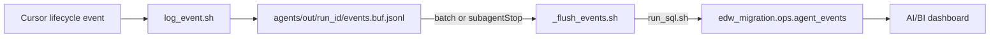

# .cursor/ — Cursor wiring for the EDW migration demo

```text
.cursor/
  agents/     edw-coordinator, edw-assess, edw-convert, edw-test, edw-gate
  hooks.json  lifecycle hooks (schema version 1, arrays)
  hooks/      log_event, flush, resolve run_id, subagentStop
```

## Subagents

Generated from `agents/prompts/*.md` by `agents/tools/sync_prompts.sh`.
Re-run after editing any prompt.

| Subagent | readonly | Role |
|---|---|---|
| edw-coordinator | false | Drives the run; writes artifacts for readonly stages |
| edw-assess | true | Inventory source → migration backlog |
| edw-convert | false | Convert one proc → notebook (`databricks/converted/` preferred) |
| edw-test | true | Reconcile → report JSON |
| edw-gate | true | Ship/no-ship → migration_manifest JSON |

Playbook: [agents/README.md](../agents/README.md).

## Hooks

`.cursor/hooks.json` uses Cursor schema **`version: 1`** with **arrays** of
hook definitions per event. `loop_limit: 2` on `subagentStop` matches
`max_retries` in `context.json`.

Cursor payloads do **not** include `run_id`. Hooks resolve it from
`agents/out/CURRENT_RUN` (written by the coordinator at kickoff).

| Event | Script | failClosed | Purpose |
|---|---|---|---|
| subagentStart | log_event.sh | false | Buffer start |
| afterFileEdit | log_event.sh | false | Buffer edit |
| afterShellExecution | log_event.sh | false | Buffer shell |
| afterMCPExecution | log_event.sh | false | Buffer MCP |
| subagentStop | on_subagent_stop.sh | true | Flush + Gate retry decision |

### Observability flow



- Logging hooks: `failClosed: false` — flush failures leave events on disk;
  the agent run continues.
- `on_subagent_stop.sh`: `failClosed: true` — retry decision must succeed.

### Retry loop

When Gate stops with `gate=fail` and `attempt < max_retries`,
`on_subagent_stop.sh` emits a `followup_message` telling the coordinator to
re-delegate Convert. It reads `migration_manifest.json` from disk (stdin is
the hook payload, not the file). `max_retries` comes from `context.json`
(single source of truth with `loop_limit`).

### Prerequisites for hooks

- Authenticated `databricks` CLI
- `python3` (payload mapping / SQL helpers)
- Repo-root `.env` with `DATABRICKS_HOST`, `DATABRICKS_TOKEN`,
  `DATABRICKS_WAREHOUSE_ID`

`jq` is optional. See [docs/prerequisites.md](../docs/prerequisites.md) and
[docs/troubleshooting.md](../docs/troubleshooting.md).
