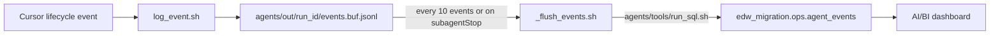

# .cursor/ — Cursor-specific wiring for the EDW migration demo

```text
.cursor/
  agents/    edw-coordinator.md, edw-assess.md, edw-convert.md, edw-test.md, edw-gate.md
  hooks.json hook wiring (lifecycle events → scripts)
  hooks/     log_event.sh, _flush_events.sh, on_subagent_stop.sh
```

## Subagents

Five subagents, generated from `agents/prompts/*.md` by
`agents/tools/sync_prompts.sh`. Re-run that script after editing any prompt.

| Subagent | readonly | Role |
|---|---|---|
| edw-coordinator | false | Drives the run, writes artifacts on behalf of readonly subagents |
| edw-assess | true | Inventory source, produce migration backlog |
| edw-convert | false | Convert one proc to a Databricks notebook |
| edw-test | true | Run reconcile.sql, produce reconcile_report.json |
| edw-gate | true | Deterministic ship/no-ship, produce migration_manifest.json |

## Hooks

Cursor hooks fire on agent lifecycle events and run deterministic scripts.
This is the observability sink and the retry-loop enforcer.

| Event | Script | failClosed | Purpose |
|---|---|---|---|
| subagentStart | log_event.sh | false | Buffer a start event |
| afterFileEdit | log_event.sh | false | Buffer a file-edit event |
| afterShellExecution | log_event.sh | false | Buffer a shell event |
| afterMCPExecution | log_event.sh | false | Buffer an MCP event |
| subagentStop | on_subagent_stop.sh | true | Final flush + retry decision |

### Observability flow



`failClosed: false` on the logging hooks means a failed log write does NOT
break the agent run (events remain buffered on disk). `failClosed: true` on
`on_subagent_stop.sh` means the retry decision must succeed or the run
aborts.

### Retry loop

When the Gate subagent stops, `on_subagent_stop.sh` reads
`agents/out/<run_id>/migration_manifest.json` from disk (NOT from stdin —
stdin is the hook payload, not file contents). If `gate=fail` and
`attempt < max_retries`, it emits a `followup_message` JSON instructing the
coordinator to re-delegate to Convert. `max_retries` is read from
`context.json` so the loop limit and the budget stay aligned (no drift
between two sources of truth).

### Prerequisites

The hooks depend on:
- `databricks` CLI (authenticated)
- `jq`
- `python3` (for some helpers)
- A `.env` at the repo root with `DATABRICKS_HOST`, `DATABRICKS_TOKEN`,
  `DATABRICKS_WAREHOUSE_ID` (see `infra/azure/.env.example`)

See [docs/prerequisites.md](../docs/prerequisites.md).
