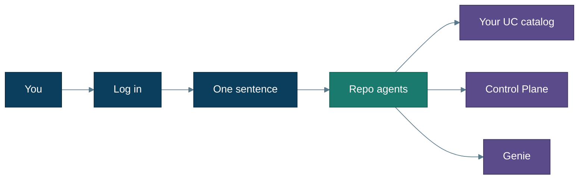
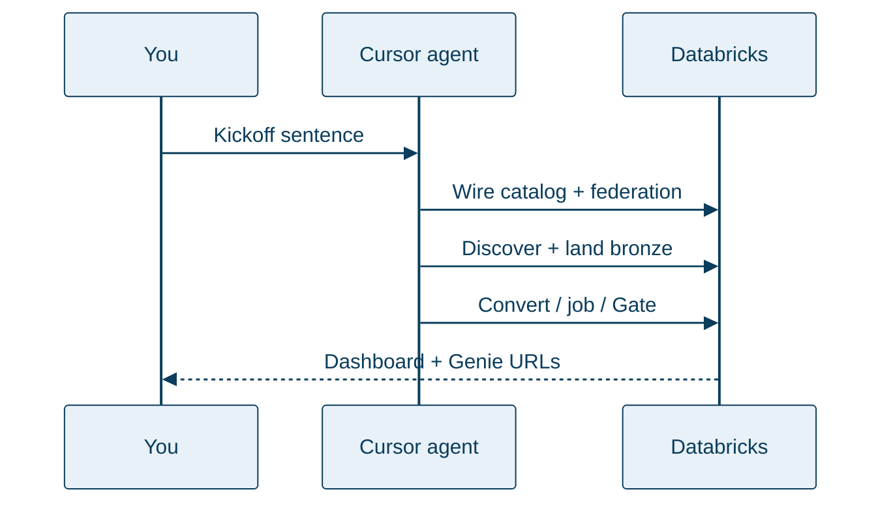

# EDW → Databricks Migration

**Watch an agent migrate a warehouse into Databricks — while you watch a Control Plane and ask Genie if the run shipped.**

You do not need to be a migration expert. You do not hand-write medallion SQL. You open this repo in Cursor, log in, say one sentence, and follow along.

**Status:** Demo-ready (Track A guided path) for **Databricks Free Edition** + Azure SQL free offer. Agent protocol includes **Parallel Convert fan-out** (waves of ≤5) as of **2026-08-08**; CI, dual-source render, and docs updated. Full Track A Gate acceptance (≥10 tables / ≥5 procs) still depends on your warehouse privileges and free-tier quotas — see [guided demo](docs/guided-demo.md) definition of done. Track B (MySQL / existing SQL) is supported in-engine; run it against your own source when ready.

---

## Jump to

| I want to… | Go here |
|---|---|
| See Cursor in three pictures | [Using Cursor](docs/cursor-ui.md) |
| Understand what I’ll get | [What you get](docs/what-you-get.md) |
| Set up for the first time | [Getting started](docs/getting-started.md) |
| **Try the free guided demo tonight** | [Guided demo (Track A)](docs/guided-demo.md) |
| Point at my own Azure SQL / MySQL | [Your database (Track B)](docs/your-database.md) |
| Plan for real orgs / SoD | [Enterprise](docs/enterprise.md) |
| Look up a term | [Glossary](docs/glossary.md) |
| One-page command checklist | [Runbook](docs/runbook.md) |
| Fix an error | [Troubleshooting](docs/troubleshooting.md) |

**Recording screenshots / hero video?** [docs/media/storyboard.md](docs/media/storyboard.md)

---

## The idea in plain English

Traditional warehouses often live in **Azure SQL** (or **MySQL**) with tables and stored procedures. Databricks wants that data in a **Unity Catalog** catalog — organized layers (bronze → silver → gold) you can govern, job, and ask questions about. ([Glossary](docs/glossary.md) if a word is new.)

This repo’s agents:

1. **Connect** to your source (live read via Lakehouse Federation)  
2. **Discover** every base table (and procedures/routines when tools allow)  
3. **Land** tables into bronze and prove row counts match  
4. **Convert** procedures into Spark SQL notebooks when there is a backlog — several at once in parallel waves (≤5)  
5. **Gate** the run — ship or no-ship, with reasons  
6. **Show** progress on a dashboard and a Genie room  

---

## Start tonight (recommended): guided demo

**Track A** builds a free sample warehouse (WideWorldImporters on Azure SQL free offer), wires it into **your** Databricks Free Edition catalog, and walks the migration with you.

1. Open the **repo root** in Cursor ([Getting started](docs/getting-started.md) · [Using Cursor](docs/cursor-ui.md))  
2. Launch **`edw-demo-guide`** and say:

   > Set up the EDW demo and walk me through the migration.

3. If preflight asks for a login or install, do **that one thing**, then say continue.

Full hand-holding: **[Guided demo](docs/guided-demo.md)** · Tool reference: **[Prerequisites](docs/prerequisites.md)**

When you’re done: ask the guide to tear down (or `make teardown`).

---

## Who are you? (after the demo smile)

| Persona | Next |
|---|---|
| **Learning / SE / first try** | Stay on [Guided demo](docs/guided-demo.md); then [What you get](docs/what-you-get.md) |
| **Have a sandbox DB** | [Your database](docs/your-database.md) |
| **Platform / security / prod** | **[Enterprise](docs/enterprise.md)** — SoD, OAuth, private network, CI |
| **Extending the engine** | [Architecture](docs/architecture.md) · [CONTRIBUTING](CONTRIBUTING.md) |

---

## Later: your own database

Same simplicity — you bring logins and connection fields; agents do the rest.

→ **[Your database (Track B)](docs/your-database.md)** — Azure MySQL or existing Azure SQL.

For production-shaped controls (not Free Edition public firewall), read **[Enterprise](docs/enterprise.md)** first.

---

## What “done” looks like

- Tables in `${DATABRICKS_CATALOG}.bronze.*`  
- **Control Plane** + **Genie** URLs (`make print-urls`)  
- Gate ship with empty blockers (demo also aims for ≥10 tables / ≥5 procs as **counts**)  

More: **[What you get](docs/what-you-get.md)**

---

## You vs the agent

| You | Agent / Makefile |
|---|---|
| Open this repo at the **git root** in Cursor | Loads agents + hooks |
| Log in (Azure and/or Databricks) | Verifies auth; writes `.env` |
| One kickoff sentence | Federation → discover → land → convert → job → Gate |
| Watch Dashboard + Genie; confirm if asked (>200 tables) | Prints URLs; clears blockers on retry |

No object lists. No Lakebridge. No hand-written landing SQL.

---

## Docs map

| Path | For |
|---|---|
| [docs/cursor-ui.md](docs/cursor-ui.md) | Three-step Cursor visuals |
| [docs/getting-started.md](docs/getting-started.md) | First open + logins |
| [docs/what-you-get.md](docs/what-you-get.md) | Outcomes & diagrams |
| [docs/guided-demo.md](docs/guided-demo.md) | Track A |
| [docs/your-database.md](docs/your-database.md) | Track B |
| [docs/enterprise.md](docs/enterprise.md) | SoD & production controls |
| [docs/glossary.md](docs/glossary.md) | Terms |
| [docs/README.md](docs/README.md) | Full index |

---

## License

MIT — see [LICENSE](LICENSE). WideWorldImporters sample is MIT (Microsoft).
