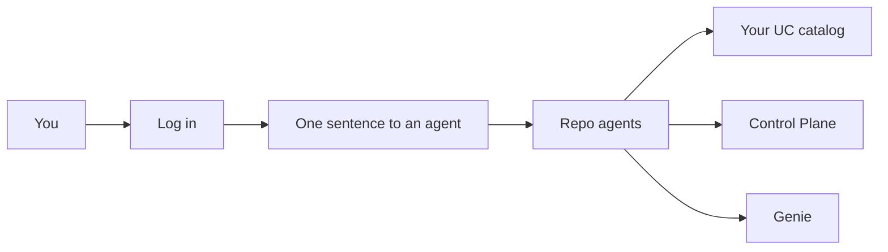
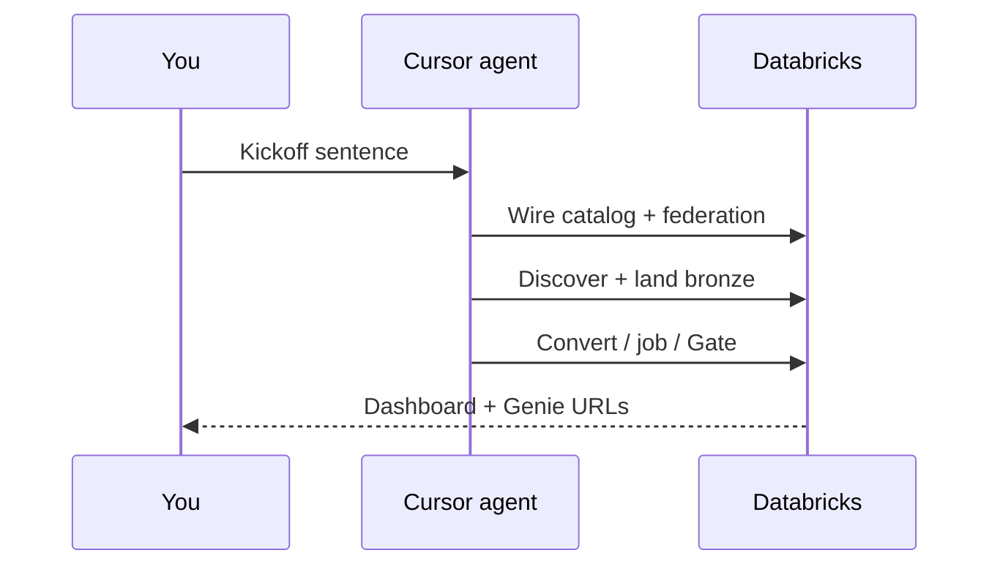

# EDW → Databricks Migration

**Watch an agent migrate a warehouse into Databricks — while you watch a Control Plane and ask Genie if the run shipped.**

You do not need to be a migration expert. You do not hand-write medallion SQL. You open this repo in Cursor, log in, say one sentence, and follow along.

---

## Jump to

| I want to… | Go here |
|---|---|
| Understand what I’ll get | [What you get](docs/what-you-get.md) |
| Set up Cursor for this repo | [Getting started](docs/getting-started.md) |
| **Try the free guided demo tonight** | [Guided demo (Track A)](docs/guided-demo.md) |
| Point at my own Azure SQL / MySQL | [Your database (Track B)](docs/your-database.md) |
| See a one-page command checklist | [Runbook](docs/runbook.md) |
| Fix an error | [Troubleshooting](docs/troubleshooting.md) |
| See how the engine works | [Architecture](docs/architecture.md) |

---

## The idea in plain English

Traditional warehouses often live in **Azure SQL** (or **MySQL**) with tables and stored procedures. Databricks wants that data in a **Unity Catalog** catalog — organized layers (bronze → silver → gold) you can govern, job, and ask questions about.

This repo’s agents:

1. **Connect** to your source (live read via Lakehouse Federation)  
2. **Discover** every base table (and procedures/routines when tools allow)  
3. **Land** tables into bronze and prove row counts match  
4. **Convert** procedures into Spark SQL notebooks when there is a backlog  
5. **Gate** the run — ship or no-ship, with reasons  
6. **Show** progress on a dashboard and a Genie room  

---

## Start tonight (recommended): guided demo

**Track A** builds a free sample warehouse (WideWorldImporters on Azure SQL free offer), wires it into **your** Databricks Free Edition catalog, and walks the migration with you.

1. Install basics → see [Getting started](docs/getting-started.md)  
2. `az login` and `databricks auth login --host <your-workspace-url>`  
3. In Cursor, launch **`edw-demo-guide`** and say:

   > Set up the EDW demo and walk me through the migration.

Full hand-holding: **[Guided demo](docs/guided-demo.md)** · Tools list: **[Prerequisites](docs/prerequisites.md)**

When you’re done: ask the guide to tear down (or `make teardown`) so the free Azure resources disappear.

---

## Later: your own database

Same simplicity — you bring logins and connection fields; agents do the rest.

→ **[Your database (Track B)](docs/your-database.md)** — Azure MySQL or existing Azure SQL.

---

## What “done” looks like

- Tables in `${DATABRICKS_CATALOG}.bronze.*`  
- A **Control Plane** dashboard and a **Genie** room (`make print-urls`)  
- A Gate result: ship with empty blockers (demo also aims for ≥10 tables / ≥5 procs as **counts**)  

More: **[What you get](docs/what-you-get.md)**

---

## You vs the agent

| You | Agent / Makefile |
|---|---|
| Open this repo at the **git root** in Cursor | Loads agents + hooks |
| Log in (Azure and/or Databricks) | Verifies auth; writes `.env` |
| One kickoff sentence | Federation → discover → land → convert → job → Gate |
| Watch Dashboard + Genie; confirm if asked (>200 tables) | Prints URLs; clears blockers on retry |

No object lists. No Lakebridge. No hand-written landing SQL.

---

## Docs map

| Path | For |
|---|---|
| [docs/getting-started.md](docs/getting-started.md) | First open: Cursor + logins |
| [docs/what-you-get.md](docs/what-you-get.md) | Outcomes & diagrams |
| [docs/guided-demo.md](docs/guided-demo.md) | Track A step-by-step |
| [docs/your-database.md](docs/your-database.md) | Track B MySQL / SQL |
| [docs/agent-setup.md](docs/agent-setup.md) | Agents & kickoff sentences |
| [docs/runbook.md](docs/runbook.md) | Short operator checklist |
| [docs/troubleshooting.md](docs/troubleshooting.md) | When something breaks |
| [docs/architecture.md](docs/architecture.md) | Engine deep dive |
| [docs/README.md](docs/README.md) | Full documentation index |

---

## License

MIT — see [LICENSE](LICENSE). WideWorldImporters sample is MIT (Microsoft).
