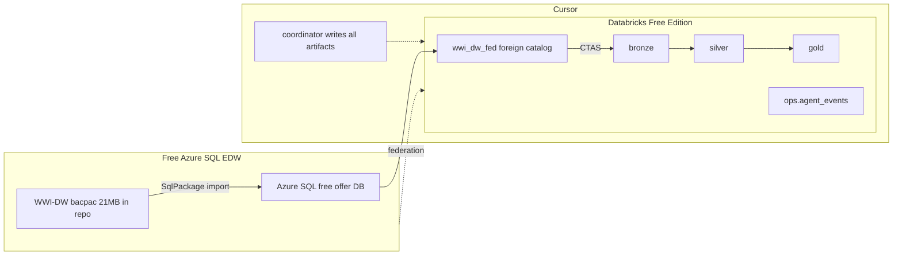

# EDW → Databricks AI-Assisted Migration Demo

A self-serve, fully replicable demo of migrating a medium-complexity EDW
(star schema + stored procedures) from **free Azure SQL** into **Databricks
Free Edition** Unity Catalog, using a **Cursor coordinator + subagent
playbook** with hook-driven observability and a deterministic retry loop.

The repo is the deliverable. Clone it, run `bootstrap.sh`, run the bundle,
launch the coordinator subagent in Cursor, and watch the agents migrate the
EDW live.

## What you get

- A vendored WideWorldImportersDW `.bacpac` (Microsoft sample EDW, 21 MB).
- One-click Azure SQL provisioning on the **free offer** (zero bill beyond
  allowance, `AutoPause` on limit).
- Lakehouse Federation from Databricks Free Edition to Azure SQL — assess
  and reconcile in place, materialize a bronze → silver → gold medallion.
- A Cursor **coordinator subagent** that drives **Assess → Convert → Test →
  Gate** stage subagents, with a bounded retry loop on gate failures.
- **Observability via Cursor hooks** writing structured events to a Unity
  Catalog Delta table (`edw_migration.ops.agent_events`), viewed live in an
  **AI/BI dashboard**.
- A Databricks Asset Bundle that runs the whole medallion as a single
  Lakeflow Job.

## Architecture



## Quickstart (30 min)

1. **Prerequisites** — see [docs/prerequisites.md](docs/prerequisites.md).
   You need: Azure subscription, `az`, `SqlPackage`, `sqlcmd`, `databricks`
   CLI, `jq`, `python3`, Cursor, and a Databricks Free Edition workspace.

2. **Clone & configure:**
   ```bash
   git clone <this repo>
   cd edwmigration
   cp infra/azure/.env.example .env
   $EDITOR .env   # fill in subscription, server name, password, Databricks host/token/warehouse
   set -a; . ./.env; set +a
   ```

3. **Provision Azure SQL + load the EDW:**
   ```bash
   ./infra/azure/bootstrap.sh --dry-run   # validate
   ./infra/azure/bootstrap.sh             # ~10 min
   ```

4. **Deploy the Databricks medallion:**
   ```bash
   databricks bundle deploy
   databricks bundle run edw_migration_medallion
   ```

5. **Run the agent workflow in Cursor:**
   - Open this repo in Cursor.
   - Launch the `edw-coordinator` subagent with a kickoff message like:
     > Start an EDW migration run. Scope: Fact.Sale, Fact.Stockholding,
     > Dimension.Customer, Dimension.City, Dimension.StockItem. Migrate the
     > Integration.* procs.
   - Watch `ops.agent_events` live in the AI/BI dashboard
     (`databricks/dashboards/agent_events.lvdash.json`).
   - Read the final manifest at `agents/out/<run_id>/migration_manifest.json`.

6. **Tear down when done:**
   ```bash
   ./infra/azure/teardown.sh
   ```

## Repo layout

```text
infra/azure/            Azure SQL provisioning (bootstrap, teardown, .env.example)
legacy/                 Source EDW: bacpac, proc source, fixtures
databricks/             UC + Federation, bronze/silver/gold, DAB bundle, reconcile, dashboard
agents/                 Tool-agnostic prompts + contracts + tools
.cursor/                Cursor subagents + hooks (observability + retry)
docs/                   Runbook, prerequisites, limits, firewall, Lakeflow Connect
```

## Documentation

- [docs/runbook.md](docs/runbook.md) — full end-to-end run including the agent workflow
- [docs/prerequisites.md](docs/prerequisites.md) — pinned tool versions and install links
- [docs/limits.md](docs/limits.md) — Free Edition + Azure SQL free offer constraints
- [docs/firewall.md](docs/firewall.md) — the `0.0.0.0/0` demo rule and its risk
- [docs/lakeflow_connect.md](docs/lakeflow_connect.md) — why we use Federation, not Lakeflow Connect
- [agents/README.md](agents/README.md) — the agent playbook (prompts, contracts, subagents)
- [.cursor/README.md](.cursor/README.md) — Cursor subagents and hooks wiring
- [databricks/README.md](databricks/README.md) — medallion contracts and deploy/run

## Cost

- **Azure SQL:** free offer (100,000 vCore-seconds + 32 GB + 32 GB backup per
  DB per month). `AutoPause` on limit exhaustion — never charges beyond the
  allowance. See [docs/limits.md](docs/limits.md).
- **Databricks:** Free Edition (serverless only, restricted outbound, max 5
  concurrent job tasks). See [docs/limits.md](docs/limits.md).
- **Total:** $0 if you tear down after the demo.

## License

MIT. See [LICENSE](LICENSE). The WideWorldImporters sample is also MIT
licensed by Microsoft.
