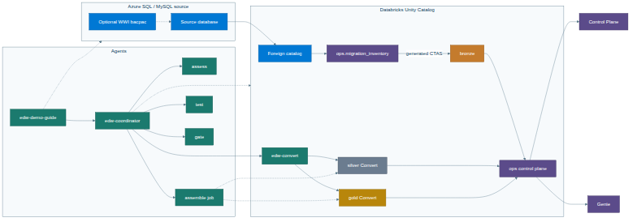
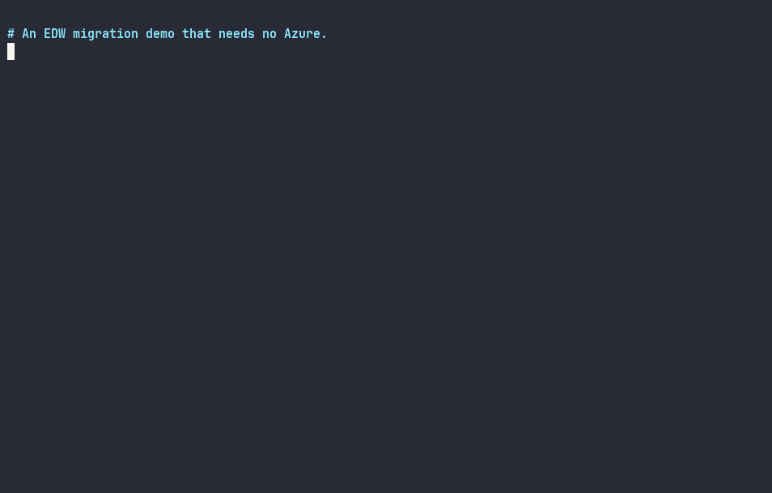
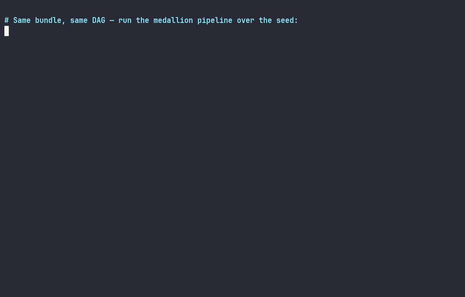
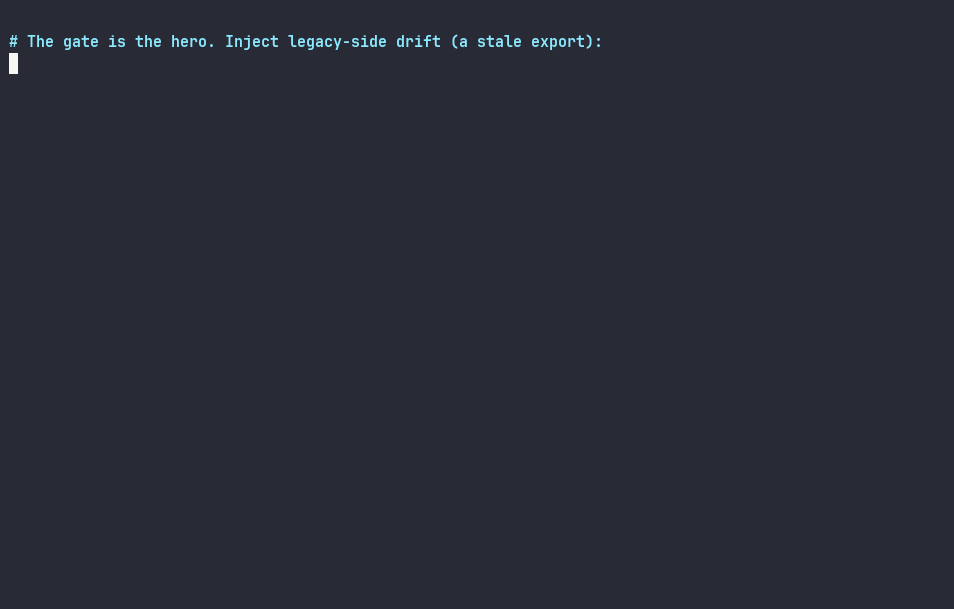
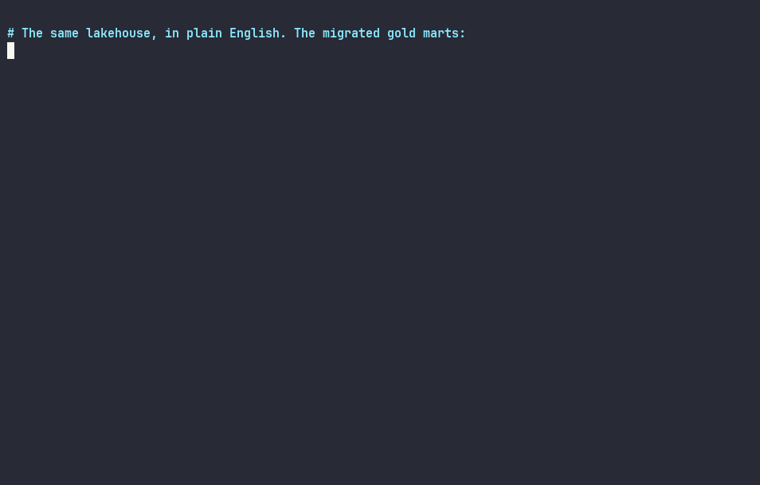
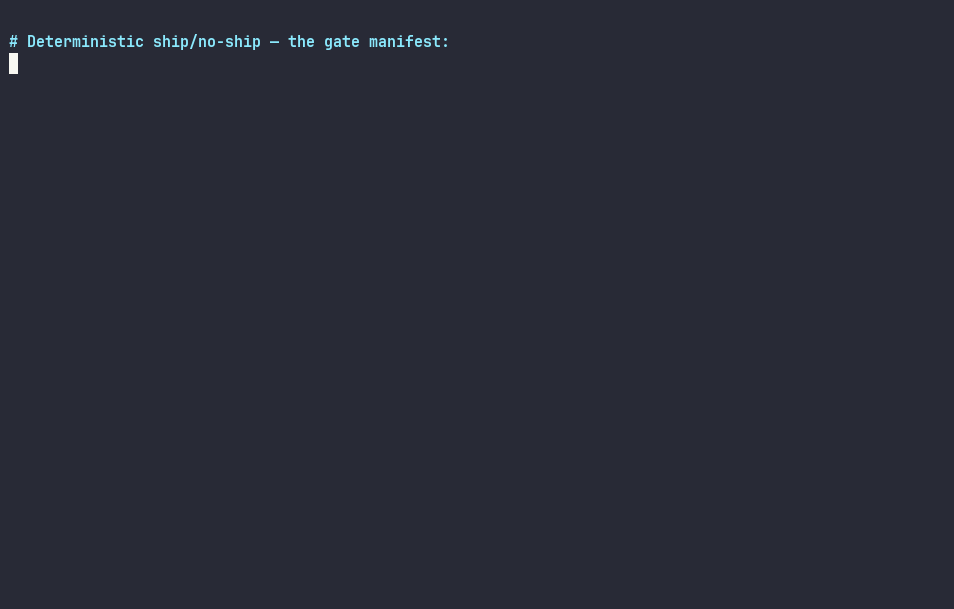
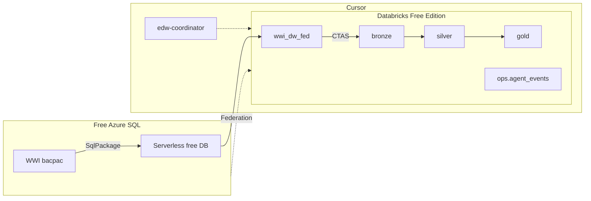

# EDW → Databricks AI-Assisted Migration Demo

Self-serve enablement repo for Databricks field engineers and technical
prospects: migrate a medium-complexity EDW (star schema + stored procedures)
from **Azure SQL free offer** into **Databricks Free Edition** Unity Catalog,
with a **Cursor coordinator + stage subagents** driving Assess → Convert →
Test → Gate, and live observability in an AI/BI dashboard.

**The repo is the deliverable.** Clone it, bootstrap Azure, deploy the
bundle, launch the coordinator in Cursor, watch the agents work.



## Watch it run

Real terminal, live Databricks Free Edition workspace, no Azure
(offline mode — [re-record](docs/media/record_demo.sh)):

**Seed the "legacy EDW"** — 25k deterministic WWI-shaped rows into `source_fed`:



**Run the medallion DAG** — same bundle, same job:



**The self-healing arc** — inject drift, the gate blocks, Genie explains why,
revert, green:



**Ask the copilot** — the migrated gold marts, in plain English:



**The gate manifest** — deterministic ship/no-ship, as data:



## Who this is for

| Audience | How to use this repo |
|---|---|
| Databricks SE / field | Run the [demo script](docs/demo-script.md); leave the prospect with the GitHub URL |
| Customer / prospect engineer | Follow the [quickstart](#quickstart--45-minutes) and [runbook](docs/runbook.md) |
| Partner / enablement | Fork, extend procs/agents; see [CONTRIBUTING.md](CONTRIBUTING.md) |

## What you get

- **WideWorldImportersDW** sample EDW (`.bacpac` vendored, SHA pinned)
- **Zero-cost Azure SQL** free offer (`AutoPause` on limit) + teardown script
- **Lakehouse Federation** into Unity Catalog (`wwi_dw_fed`) for assess/reconcile
- **Medallion** bronze → silver → gold + metric view, PK/FK, reconcile vs fixtures
- **Cursor agent playbook** — portable prompts + Cursor subagents/hooks
- **Observability** — hooks → `ops.agent_events` → AI/BI dashboard (bundle-deployed)
- **DAB job** — one Lakeflow Job for the full pipeline + lineage check

## Architecture (one picture)



Deeper design notes: [docs/architecture.md](docs/architecture.md).  
Agent delegation graph: [docs/img/agent_delegation.png](docs/img/agent_delegation.png).

## Quickstart (~45 minutes)

Full detail lives in the [runbook](docs/runbook.md). Abbreviated path below —
or one command for steps 1–3: `make demo` (see [Makefile](Makefile)).
No Azure? `make demo-offline` runs the same pipeline on a seeded `source_fed`
(Databricks workspace still required).

```bash
# 0) Prereqs — docs/prerequisites.md
git clone https://github.com/Jericho2010/edwmigration.git
cd edwmigration
cp infra/azure/.env.example .env
# Edit .env: Azure + DATABRICKS_HOST / TOKEN / WAREHOUSE_ID
set -a; . ./.env; set +a

# 1) Azure SQL EDW (~10 min)
./infra/azure/bootstrap.sh --dry-run
./infra/azure/bootstrap.sh

# 2) UC + Federation
./agents/tools/render_federation_sql.sh > /tmp/01_fed.sql
./agents/tools/run_sql.sh --file /tmp/01_fed.sql
./agents/tools/run_sql.sh --file databricks/uc/03_ops_and_views.sql

# 3) Medallion job + dashboard
export BUNDLE_VAR_warehouse_id="$DATABRICKS_WAREHOUSE_ID"
databricks bundle validate -t dev
databricks bundle deploy -t dev
databricks bundle run edw_migration_medallion -t dev

# 4) Agents — open this repo in Cursor, launch edw-coordinator:
#    "Start an EDW migration run. Scope: Fact.Sale, Fact.Stockholding,
#     Dimension.Customer, Dimension.City, Dimension.StockItem.
#     Migrate the Integration.* procs."
# Watch: AI/BI dashboard "[dev] EDW Migration Agent Events"

# 5) Tear down Azure when finished
./infra/azure/teardown.sh
```

Offline Gate demo without Azure: copy [agents/samples/run/](agents/samples/run/)
into `agents/out/<run_id>/` (see [agents/samples/README.md](agents/samples/README.md)).

## Documentation map

| Doc | Purpose |
|---|---|
| [docs/README.md](docs/README.md) | Index of all docs |
| [docs/demo-script.md](docs/demo-script.md) | SE talk track (15 / 30 / 45 min) |
| [docs/runbook.md](docs/runbook.md) | End-to-end operator runbook |
| [docs/prerequisites.md](docs/prerequisites.md) | Tools, versions, verify commands |
| [docs/architecture.md](docs/architecture.md) | Medallion, federation, agents, hooks |
| [docs/troubleshooting.md](docs/troubleshooting.md) | Failures and fixes |
| [docs/limits.md](docs/limits.md) | Free Edition + Azure free offer |
| [docs/firewall.md](docs/firewall.md) | Why `0.0.0.0/0` and how to tear it down |
| [docs/lakeflow_connect.md](docs/lakeflow_connect.md) | Why Federation, not Lakeflow Connect |
| [agents/README.md](agents/README.md) | Agent playbook |
| [databricks/README.md](databricks/README.md) | Medallion contracts + DAB |
| [CONTRIBUTING.md](CONTRIBUTING.md) | How to extend the demo |

## Repo layout

```text
infra/azure/     bootstrap.sh, teardown.sh, .env.example
legacy/          bacpac, procs/, fixtures/
databricks/      uc/, bronze/, silver/, gold/, jobs/, tests/, dashboards/
agents/          prompts/, contracts/, tools/, samples/
.cursor/         agents/ + hooks.json + hooks/
docs/            runbook, architecture, demo-script, …
```

## Cost

| Surface | Model |
|---|---|
| Azure SQL | Free offer — `AutoPause` when allowance exhausted ([limits](docs/limits.md)) |
| Databricks | Free Edition — serverless only ([limits](docs/limits.md)) |
| **Total** | **$0** if you tear down Azure after the demo |

## License

MIT — see [LICENSE](LICENSE). WideWorldImporters sample is MIT (Microsoft).
