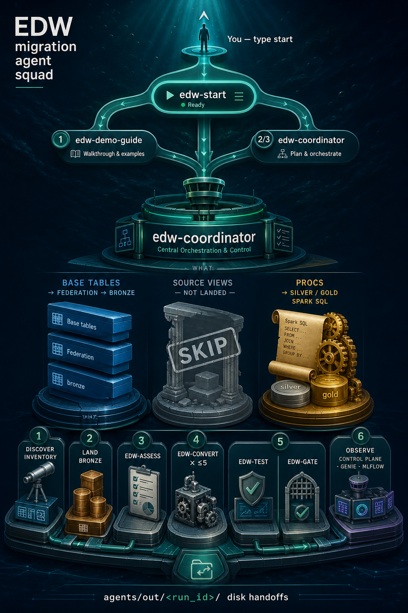
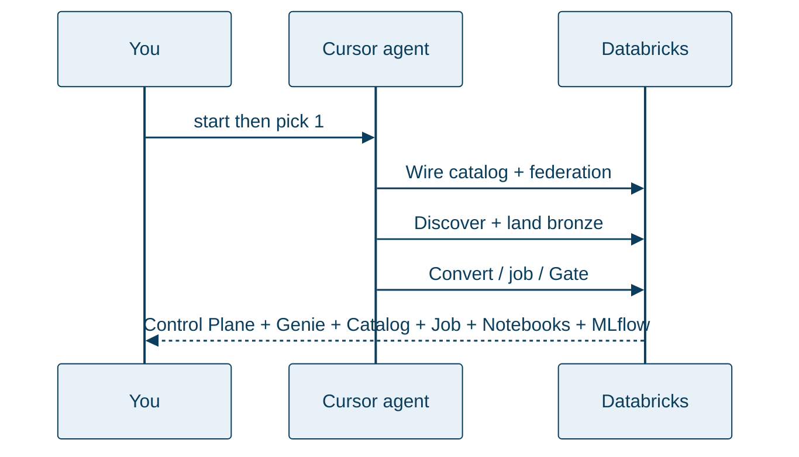

# EDW → Databricks Migration

**Watch an agent migrate a warehouse into Databricks — while you watch a Control Plane, Catalog, Job, and Workspace notebooks, ask Genie if the run shipped, and follow live MLflow traces of every subagent.**

You do not need to be a migration expert. You do not hand-write medallion SQL. Open this repo in Cursor, type **`start`**, pick a menu item, and follow along. Log in only when the agent asks.

**Demo-ready** on **Databricks Free Edition** + Azure SQL free offer (Track A). Your own Azure SQL / MySQL works too (Track B). Details and acceptance counts: [guided demo](docs/guided-demo.md).

**Observability:** Control Plane + Genie + Catalog + Job + Notebooks + **[MLflow live traces](docs/mlflow.md)** — how Cursor hooks wire every `edw-*` subagent into one span tree.

Type **`start`** — these agents do the rest:

Pipeline detail (convert waves, merge, retries): [agent_delegation.png](docs/img/agent_delegation.png) · [What you get](docs/what-you-get.md) · [MLflow](docs/mlflow.md)

---

## Jump to

| I want to… | Go here |
|---|---|
| See Cursor in three pictures | [Using Cursor](docs/cursor-ui.md) |
| Use **Cursor CLI** or **Copilot CLI** | [CLI setup](docs/cli-setup.md) |
| Understand what I’ll get | [What you get](docs/what-you-get.md) |
| **Watch MLflow / observability** | **[MLflow observability](docs/mlflow.md)** |
| Set up for the first time | [Getting started](docs/getting-started.md) |
| **Recommended first run** | [Guided demo (Track A)](docs/guided-demo.md) |
| Point at my own Azure SQL / MySQL | [Your database (Track B)](docs/your-database.md) |
| Plan for real orgs / SoD | [Enterprise](docs/enterprise.md) |
| Look up a term | [Glossary](docs/glossary.md) |
| One-page command checklist | [Runbook](docs/runbook.md) |
| Fix an error | [Troubleshooting](docs/troubleshooting.md) |

**Recording screenshots / hero video?** [docs/media/storyboard.md](docs/media/storyboard.md)

---

## The idea in plain English

Traditional warehouses often live in **Azure SQL** (or **MySQL**) with tables and stored procedures. Databricks wants that data in a **Unity Catalog** catalog — organized layers (bronze → silver → gold) you can govern, job, and ask questions about. ([Glossary](docs/glossary.md) if a word is new.)

This repo’s agents:

1. **Connect** to your source (live read via Lakehouse Federation)  
2. **Discover** every base table (and procedures/routines when tools allow)  
3. **Land** tables into bronze and prove row counts match  
4. **Convert** procedures into Spark SQL (`.sql` under `databricks/silver|gold`) when there is a backlog  
5. **Wire** new SQL files into the medallion job when needed (`check_job_wiring.py --apply`; safe concurrency)  
6. **Gate** the run — ship or no-ship, with reasons  
7. **Show** progress on a Control Plane, Genie, Catalog, Job, Workspace notebooks (`edwmigration_YYYYMMDD`), and **[MLflow](docs/mlflow.md)** live agent/tool traces (`observe_url`)

---

## Recommended first run: type `start`

1. Open the **repo root** in **Cursor** ([Getting started](docs/getting-started.md) · [Using Cursor](docs/cursor-ui.md)) — hooks need Cursor at the root (VS Code alone won’t dual-write the same way).  
2. **Recommended for live traces:** `make observe-setup` once (creates `.venv` + installs MLflow). Soft status / Track A preflight report readiness; migration still works without it. Full write-up: **[docs/mlflow.md](docs/mlflow.md)**.
3. Type **`start`** (or launch **`edw-start`**) — soft status + phrase menu. Confirm `[mlflow_check] ready` if you want traces.  
4. Choose **1** for the guided demo:

   > Set up the EDW demo and walk me through the migration.

5. If Track A preflight asks for a login or install, do **that one thing**, then say continue.

**Track A** builds a free sample warehouse (WideWorldImporters on Azure SQL free offer), wires it into **your** Databricks Free Edition catalog, and walks the migration with you.

Full hand-holding: **[Guided demo](docs/guided-demo.md)** · Tool reference: **[Prerequisites](docs/prerequisites.md)**

When you’re done: menu **5**, then confirm **Databricks** wipe (`make teardown-databricks`, keeps Azure SQL) and/or **Azure** (`make teardown`).

---

## Who are you? (after the demo smile)

| Persona | Next |
|---|---|
| **Learning / SE / first try** | Stay on [Guided demo](docs/guided-demo.md); then [What you get](docs/what-you-get.md) · [MLflow](docs/mlflow.md) |
| **Have a sandbox DB** | [Your database](docs/your-database.md) |
| **Watch agents live** | **[MLflow observability](docs/mlflow.md)** — Control Plane + Genie + Catalog + Job + Notebooks + traces |
| **Platform / security / prod** | **[Enterprise](docs/enterprise.md)** — SoD, OAuth, private network, CI |
| **Extending the engine** | [Architecture](docs/architecture.md) · [CONTRIBUTING](CONTRIBUTING.md) |

---

## Later: your own database

Same simplicity — you bring logins and connection fields; agents do the rest.

→ **[Your database (Track B)](docs/your-database.md)** — Azure MySQL or existing Azure SQL (`start` → **2** or **3**).

For production-shaped controls (not Free Edition public firewall), read **[Enterprise](docs/enterprise.md)** first.

---

## What “done” looks like

- Tables in `${DATABRICKS_CATALOG}.bronze.*`  
- **Control Plane** + **Genie** + **Catalog** + **Job** + **Notebooks** (`edwmigration_YYYYMMDD` after Land) + **MLflow `observe_url`** (`make print-urls`; observe link appears after the coordinator mints a run)  
- Gate ship with empty blockers  
- Demo path also checks **counts** (≥10 tables / ≥5 procs) — that is demo acceptance, not a Gate rule  

More: **[What you get](docs/what-you-get.md)** · **[MLflow observability](docs/mlflow.md)**

---

## You vs the agent

| You | Agent / Makefile |
|---|---|
| Open this repo at the **git root** in Cursor | Loads agents + hooks |
| Type **`start`** and pick a menu item | Soft status + routes to the right agent |
| Fix only what preflight / the agent names (login, install, warehouse) | Writes `.env`; federation → discover → land → convert → job → Gate |
| Watch Dashboard + Genie + Catalog + Job + Notebooks; confirm if asked (>200 tables) | Prints URLs; clears blockers on retry |

No object lists. No Lakebridge. No hand-written landing SQL.

---

## Docs map

| Path | For |
|---|---|
| [docs/cursor-ui.md](docs/cursor-ui.md) | Three-step Cursor visuals |
| [docs/cli-setup.md](docs/cli-setup.md) | Cursor CLI + Copilot CLI |
| [docs/getting-started.md](docs/getting-started.md) | First open + `start` menu |
| [docs/what-you-get.md](docs/what-you-get.md) | Outcomes & diagrams |
| [docs/guided-demo.md](docs/guided-demo.md) | Track A |
| [docs/your-database.md](docs/your-database.md) | Track B |
| [docs/enterprise.md](docs/enterprise.md) | SoD & production controls |
| [docs/glossary.md](docs/glossary.md) | Terms |
| [docs/README.md](docs/README.md) | Full index |

---

## License

MIT — see [LICENSE](LICENSE). WideWorldImporters sample is MIT (Microsoft).
