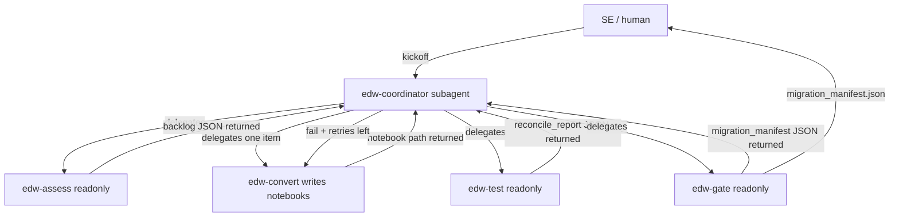

# agents/ — AI agent playbook (tool-agnostic prompts + Cursor subagent wiring)

This directory holds the **tool-agnostic** agent artifacts (prompts and
contracts) plus the Cursor-specific wiring (`.cursor/agents/`).

## Layout

```text
agents/
  prompts/        00_coordinator.md, 01_assess.md, 02_convert.md, 03_test.md, 04_gate.md, convert_style.md
  contracts/      context.schema.json, migration_backlog.schema.json, migration_manifest.schema.json
  tools/          sync_prompts.sh, render_manifest_table.py
  out/            runtime output per run_id (gitignored)
.cursor/agents/   edw-coordinator.md, edw-assess.md, edw-convert.md, edw-test.md, edw-gate.md
```

## Prompts vs subagents

Prompts in `agents/prompts/` are the **portable, tool-agnostic** source of
truth. Cursor subagent files in `.cursor/agents/` are generated from the
prompts by `agents/tools/sync_prompts.sh` (which prepends Cursor frontmatter
and copies the prompt body). To port to another runtime (Claude Code, Codex),
point it at `agents/prompts/` directly.

After editing any prompt, re-sync:

```bash
./agents/tools/sync_prompts.sh
```

## Delegation graph



## Write model

| Subagent | readonly | Write scope | Role |
|---|---|---|---|
| edw-coordinator | false | `agents/out/<run_id>/`; delegates all content writes | Drives pipeline, owns run_id + retry budget, writes artifacts on behalf of readonly subagents |
| edw-assess | true | none (returns backlog JSON to coordinator) | Inventory source, map to medallion targets, risk flags |
| edw-convert | false | `databricks/silver/`, `databricks/gold/` (path-scoped by prompt) | Convert one backlog proc to Spark SQL/notebook |
| edw-test | true | none (returns reconcile_report JSON to coordinator) | Prove bronze matches source, gold matches fixtures |
| edw-gate | true | none (returns migration_manifest JSON to coordinator) | Deterministic ship/no-ship |

**Coordinator-writes-on-behalf:** `assess`, `test`, and `gate` are
`readonly: true` and return structured JSON in their final message. The
coordinator writes that JSON to `agents/out/<run_id>/` and inserts into the
relevant `ops.*` table. Only `convert` writes files directly (notebooks).
This resolves the readonly-vs-write contradiction — Cursor's `readonly` is
boolean, not path-scoped, so readonly subagents cannot write files or run
state-changing SQL.

## Contracts

- `context.schema.json` — shared run context (written by coordinator at kickoff).
- `migration_backlog.schema.json` — Assess output (one item per proc).
- `migration_manifest.schema.json` — Gate output (ship/no-ship + blockers).

## Running the agents

Open this repo in Cursor and launch the `edw-coordinator` subagent with a
kickoff message like:

> Start an EDW migration run. Scope: Fact.Sale, Fact.Stockholding,
> Dimension.Customer, Dimension.City, Dimension.StockItem. Migrate the
> Integration.* procs.

The coordinator will drive Assess → Convert → Test → Gate, write artifacts
to `agents/out/<run_id>/`, and emit a manifest. Watch `ops.agent_events` live
in the AI/BI dashboard (`databricks/dashboards/agent_events.lvdash.json`).
