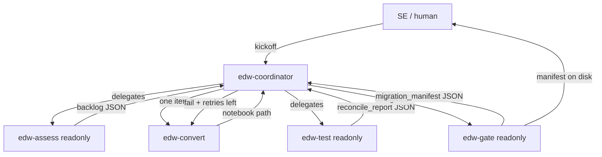

# agents/ — AI agent playbook (tool-agnostic prompts + Cursor wiring)

Tool-agnostic prompts and JSON contracts, plus Cursor subagent generation.
Cursor-specific hooks live under [`.cursor/`](../.cursor/README.md).

## Layout

```text
agents/
  prompts/     00_coordinator … 04_gate + convert_style.md
  contracts/   context / backlog / manifest JSON Schema
  tools/       run_sql.sh, render_federation_sql.sh, sync_prompts.sh,
               render_manifest_table.py
  samples/     offline Gate/Test artifacts
  out/         runtime output per run_id (gitignored) + CURRENT_RUN
.cursor/agents/   generated Cursor subagent files
```

## Prompts vs subagents

`agents/prompts/` is the portable source of truth. `.cursor/agents/` is
generated by `agents/tools/sync_prompts.sh` (Cursor frontmatter + prompt body).
After editing a prompt:

```bash
./agents/tools/sync_prompts.sh
```

## Delegation graph



PNG: [docs/img/agent_delegation.png](../docs/img/agent_delegation.png)

## Write model

| Subagent | readonly | Write scope | Role |
|---|---|---|---|
| edw-coordinator | false | `agents/out/<run_id>/`, `agents/out/CURRENT_RUN`; persists readonly-stage JSON + `ops.*` inserts | Owns `run_id`, retry budget, orchestration |
| edw-assess | true | none (returns backlog JSON) | Inventory source → medallion backlog |
| edw-convert | false | Prefer `databricks/converted/`; only write baseline `silver/`/`gold/` if no file exists | Convert one proc → Spark SQL notebook |
| edw-test | true | none (returns reconcile_report JSON) | Prove bronze↔source and gold↔fixtures |
| edw-gate | true | none (returns migration_manifest JSON) | Deterministic ship/no-ship |

**Coordinator-writes-on-behalf:** Assess/Test/Gate are `readonly: true` and
return structured JSON. The coordinator writes files under `agents/out/` and
inserts into `ops.*`. Only Convert writes notebooks. Cursor `readonly` is
boolean, not path-scoped.

**Baseline safety:** Convert must not overwrite job-DAG silver/gold files.
When a baseline exists, write `databricks/converted/<same-basename>.sql`.

## Contracts

| Schema | Producer | Purpose |
|---|---|---|
| `context.schema.json` | coordinator | Shared run context + `max_retries` |
| `migration_backlog.schema.json` | assess (via coordinator) | One item per proc |
| `migration_manifest.schema.json` | gate (via coordinator) | Ship/no-ship + blockers |

## Tools

| Tool | Purpose |
|---|---|
| `tools/run_sql.sh` | Statement Execution API (`--sql` / `--file`) |
| `tools/render_federation_sql.sh` | Fill Azure host/admin into `01_federation_setup.sql` |
| `tools/sync_prompts.sh` | Regenerate `.cursor/agents/` from prompts |
| `tools/render_manifest_table.py` | Pretty-print a gate manifest |

## Running the agents

1. Finish medallion deploy ([runbook](../docs/runbook.md) §§1–5).
2. Open this repo in Cursor; launch **`edw-coordinator`**.
3. Kickoff:

   > Start an EDW migration run. Scope: Fact.Sale, Fact.Stockholding,
   > Dimension.Customer, Dimension.City, Dimension.StockItem.
   > Migrate the Integration.* procs.

4. Watch `[dev] EDW Migration Agent Events` (`ops.agent_events`).

Offline: [samples/README.md](samples/README.md).
