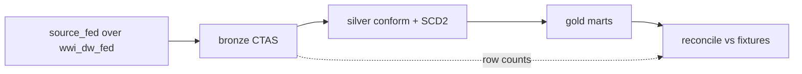

# databricks/ — medallion assets + DAB

```text
databricks/
  databricks.yml          Bundle root (variables, includes, targets.dev)
  uc/                     Unity Catalog + Federation + lineage check
  bronze/                 1:1 land from source_fed + audit columns
  silver/                 Conform, SCD2 customer, orphan quarantine, constraints
  gold/                   Marts + metric view (job baselines)
  converted/              Agent Convert output (does not overwrite baselines)
  jobs/                   Medallion job + dashboard resource YAMLs
  tests/                  Fixture staging + reconcile.sql
  dashboards/             agent_events.lvdash.json (AI/BI)
  genie/                  Genie space config + idempotent deploy script
```

### Genie space (optional)

`./databricks/genie/create_genie_space.sh` (or `make genie`) deploys the
"EDW Migration Copilot" Genie space over the `ops.*` control-plane tables and
`gold.*` marts — natural-language questions like "Why did the last migration
run fail the gate?" Config: `genie/space_config.json` (serialized Genie
space v2; tables must be sorted by identifier, IDs are 32-hex without
hyphens — both validated against the live Genie API).

## Medallion flow



## Deploy and run

```bash
export BUNDLE_VAR_warehouse_id="$DATABRICKS_WAREHOUSE_ID"
databricks bundle validate -t dev
databricks bundle deploy -t dev
databricks bundle run edw_migration_medallion -t dev
```

- SQL paths in `jobs/*.yml` are **relative to that YAML file**
  (AI Dev Kit path-resolution rule).
- Warehouse ID: `BUNDLE_VAR_warehouse_id` (not `${DATABRICKS_WAREHOUSE_ID}`
  inside YAML).
- Dashboard deploys with the same bundle (no manual import).

### Job tasks (dependency order)

`federation_smoke` → parallel bronze dims/facts + `stage_fixtures` → silver
dims / SCD2 / fact_sale → gold marts + metric view + constraints →
`reconcile` → `lineage_check`. Peak fan-out stays under Free Edition’s
5 concurrent tasks. Full YAML: `jobs/edw_migration_medallion.yml`.

## Free Edition constraints

- Serverless SQL warehouse only.
- Max 5 concurrent job tasks.
- Restricted outbound internet — Azure SQL federation works; arbitrary egress may not.
- Details: [docs/limits.md](../docs/limits.md).

## Medallion contracts

### Bronze

1:1 land from `source_fed.*`, snake_case, audit columns
`_bronze_loaded_at`, `_source_system='wwi_azure_sql'`, `_batch_id`.
`CREATE OR REPLACE TABLE … AS SELECT`. `ops.load_control` per load.

### Silver

Conform types, normalize keys (WWI `` `Customer Key` `` /
`` `Stock Item Key` ``), SCD2 on customer, orphan-fact quarantine on sales.

### Gold (baselines for the job)

| Gold object | Replaces (conceptually) | Pattern |
|---|---|---|
| `mart_daily_internet_sales` | GetStockItemUpdates + aggregation | CTAS daily |
| `mart_stock_movements` | MigrateStagedStockItemData | INSERT OVERWRITE |
| `mart_customer_current` | MigrateStagedCustomerData | current snapshot |
| `mart_city_dimension` | GetCityUpdates | CTAS |
| daily sales metric view | BI consumption | UC metric view |

### `converted/`

Agent Convert notebooks land here when a baseline silver/gold file already
exists, so the job DAG stays stable. See [converted/README.md](converted/README.md).

## UC setup order

See [uc/README.md](uc/README.md). Use `agents/tools/run_sql.sh` (Statement API).
