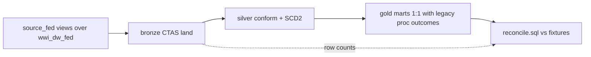

# databricks/ — Databricks medallion assets

```text
databricks/
  databricks.yml                DAB bundle root (variables, include)
  uc/                           Unity Catalog + Federation setup
  bronze/                       1:1 land from source_fed, with audit columns
  silver/                       Conformed types, SCD2 on customer, orphan quarantine
  gold/                         1:1 mapping to legacy Integration.* proc outcomes (marts)
  jobs/                         edw_migration_medallion.yml (DAB job resource)
  tests/                        reconcile.sql
  dashboards/                    agent_events.lvdash.json (AI/BI dashboard)
```

## Medallion flow



## Deploy & run

```bash
export BUNDLE_VAR_warehouse_id="$DATABRICKS_WAREHOUSE_ID"
databricks bundle validate -t dev
databricks bundle deploy -t dev
databricks bundle run edw_migration_medallion -t dev
```

SQL file paths in `databricks/jobs/*.yml` are **relative to that YAML file**
(AI Dev Kit path-resolution rule). Warehouse ID comes from
`BUNDLE_VAR_warehouse_id` (not `${DATABRICKS_WAREHOUSE_ID}` inside YAML).

## Free Edition constraints

- Serverless SQL warehouse only (no classic clusters).
- Max 5 concurrent job tasks — the job is sequential, so well under.
- Restricted outbound internet — federation to Azure SQL works because the
  server is on the trusted allowlist; other egress may not.
- See [docs/limits.md](../docs/limits.md).

## Medallion contracts

### Bronze

1:1 land from `source_fed.*`, snake_case names, audit columns
`_bronze_loaded_at`, `_source_system='wwi_azure_sql'`, `_batch_id`. Pattern:
`CREATE OR REPLACE TABLE ... AS SELECT ...`. `ops.load_control` row per load.

### Silver

Conform types, normalize keys, SCD2 on customer, orphan-fact quarantine on
`Fact.Sale`.

### Gold

1:1 mapping to legacy proc outcomes. Each gold table replaces one or more
`Integration.*` procs.

| Gold table | Replaces | Pattern |
|---|---|---|
| `mart_daily_internet_sales` | `Integration.GetStockItemUpdates` + aggregation | `CREATE OR REPLACE TABLE AS SELECT` daily |
| `mart_stock_movements` | `Integration.MigrateStagedStockItemData` | `INSERT OVERWRITE` snapshot |
| `mart_customer_current` | `Integration.MigrateStagedCustomerData` | current-state snapshot |
| `mart_city_dimension` | `Integration.GetCityUpdates` | `CREATE OR REPLACE TABLE AS SELECT` |
