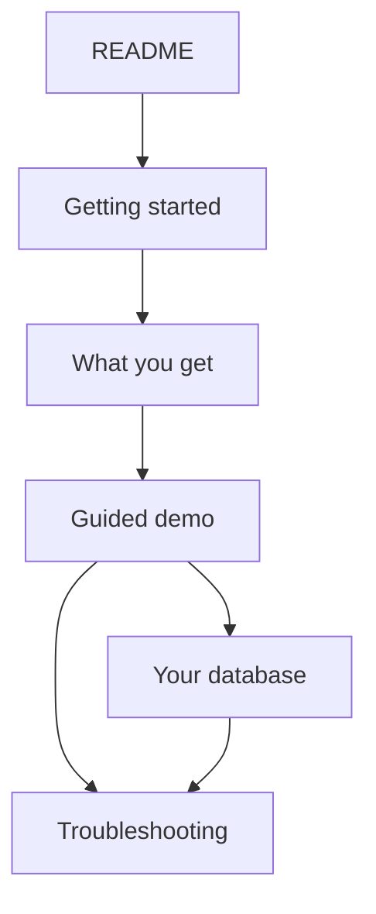

# Documentation

**New here?** Start at the root [README](../README.md), then:

1. [Getting started](getting-started.md) — Cursor + logins  
2. [What you get](what-you-get.md) — outcomes & diagrams  
3. [Guided demo](guided-demo.md) — **recommended first run (Track A)**  
4. [Your database](your-database.md) — Track B when ready  

---

## Jump by intent

| I want to… | Page |
|---|---|
| Try the free demo tonight | [guided-demo.md](guided-demo.md) |
| Launch the right Cursor agent | [agent-setup.md](agent-setup.md) |
| Connect my Azure SQL / MySQL | [your-database.md](your-database.md) |
| See a short command checklist | [runbook.md](runbook.md) |
| Fix a failure | [troubleshooting.md](troubleshooting.md) |
| Understand Free Edition limits | [limits.md](limits.md) |
| Understand firewall / public access | [firewall.md](firewall.md) |
| Compare to Lakebridge | [lakebridge.md](lakebridge.md) |
| Read engine design | [architecture.md](architecture.md) |
| Deliver an SE talk track | [demo-script.md](demo-script.md) |

---

## Learning path (narrative)

| Step | Doc |
|---|---|
| Hook & overview | [README](../README.md) |
| First setup | [getting-started.md](getting-started.md) |
| Mental model | [what-you-get.md](what-you-get.md) |
| First win | [guided-demo.md](guided-demo.md) |
| Real source | [your-database.md](your-database.md) |
| Depth | [architecture.md](architecture.md), [limits.md](limits.md) |

---

## Operator & reference

| Doc | Purpose |
|---|---|
| [agent-setup.md](agent-setup.md) | Agents + kickoff sentences + Cursor how-to |
| [prerequisites.md](prerequisites.md) | Tools and privileges |
| [runbook.md](runbook.md) | Compact Track A / B checklist |
| [troubleshooting.md](troubleshooting.md) | Symptom → fix |
| [firewall.md](firewall.md) | Free Edition reachability |
| [lakeflow_connect.md](lakeflow_connect.md) | Why Federation on Free Edition |

## Design & enablement

| Doc | Purpose |
|---|---|
| [architecture.md](architecture.md) | Engine vs demo pack |
| [limits.md](limits.md) | Free tiers + scope |
| [lakebridge.md](lakebridge.md) | Compete, don’t compose |
| [demo-script.md](demo-script.md) | SE 15 / 30 / 45 min |
| [img/](img/) | Diagram sources / GIFs |
| [media/](media/) | Asciinema notes |

## Code-adjacent READMEs

| Path | Purpose |
|---|---|
| [../agents/README.md](../agents/README.md) | Prompts & tools |
| [../databricks/README.md](../databricks/README.md) | Medallion + dashboard |
| [../demo/wwi/README.md](../demo/wwi/README.md) | Sample DW pack |
| [../infra/azure/README.md](../infra/azure/README.md) | Azure bootstrap |
| [../CONTRIBUTING.md](../CONTRIBUTING.md) | Extend engine vs demo |
