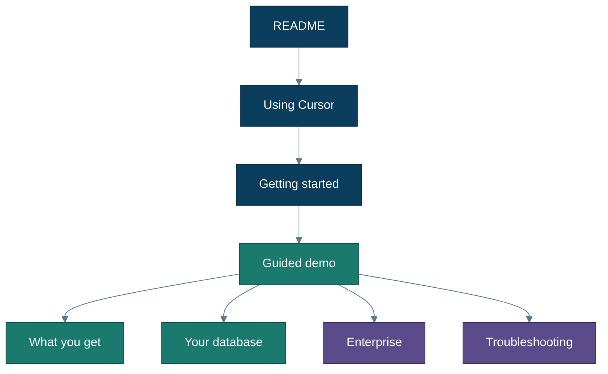

# Documentation

**New here?** Start at the root [README](../README.md), then the short path:

1. [Using Cursor](cursor-ui.md) — open root → type `start`  
2. [Getting started](getting-started.md) — `start` menu + remediations  
3. [Guided demo](guided-demo.md) — **recommended first run (Track A)**  
4. [What you get](what-you-get.md) — outcomes after you’ve smiled  
5. [Your database](your-database.md) or [Enterprise](enterprise.md)  

---

## Jump by intent

| I want to… | Page |
|---|---|
| See how to click in Cursor | [cursor-ui.md](cursor-ui.md) |
| Try the free demo tonight | [guided-demo.md](guided-demo.md) |
| Launch the right agent | [agent-setup.md](agent-setup.md) |
| Connect my Azure SQL / MySQL | [your-database.md](your-database.md) |
| Enterprise / SoD / prod controls | [enterprise.md](enterprise.md) |
| Look up a word | [glossary.md](glossary.md) |
| Short command checklist | [runbook.md](runbook.md) |
| Fix a failure | [troubleshooting.md](troubleshooting.md) |
| Unblock Azure CLI / RBAC for Track A | [azure-access-unblocking.md](azure-access-unblocking.md) |
| Diagram theme + PNG sources | [img/README.md](img/README.md) |
| Engine design | [architecture.md](architecture.md) |
| SE talk track | [demo-script.md](demo-script.md) |

---

## Learning path

| Step | Doc |
|---|---|
| Hook | [README](../README.md) |
| Cursor UI | [cursor-ui.md](cursor-ui.md) |
| Setup + `start` | [getting-started.md](getting-started.md) |
| First win | [guided-demo.md](guided-demo.md) |
| Mental model | [what-you-get.md](what-you-get.md) |
| Real source | [your-database.md](your-database.md) |
| Real org | [enterprise.md](enterprise.md) |
| Depth | [architecture.md](architecture.md), [limits.md](limits.md) |

---

## Operator & reference

| Doc | Purpose |
|---|---|
| [agent-setup.md](agent-setup.md) | `start` menu + agents + kickoffs |
| [prerequisites.md](prerequisites.md) | Tools and privileges |
| [runbook.md](runbook.md) | Compact checklist |
| [troubleshooting.md](troubleshooting.md) | Symptom → fix |
| [firewall.md](firewall.md) | Free Edition reachability |
| [lakeflow_connect.md](lakeflow_connect.md) | Why Federation on Free Edition |
| [glossary.md](glossary.md) | Terms |

## Design & enablement

| Doc | Purpose |
|---|---|
| [architecture.md](architecture.md) | Engine vs demo pack |
| [enterprise.md](enterprise.md) | SoD and production controls |
| [limits.md](limits.md) | Free tiers + scope |
| [lakebridge.md](lakebridge.md) | Compete, don’t compose |
| [demo-script.md](demo-script.md) | SE 15 / 30 / 45 min |
| [media/](media/) | [Capture storyboard](media/storyboard.md) |

## Code-adjacent READMEs

| Path | Purpose |
|---|---|
| [../agents/README.md](../agents/README.md) | Prompts & tools |
| [../databricks/README.md](../databricks/README.md) | Medallion + dashboard |
| [../demo/wwi/README.md](../demo/wwi/README.md) | Sample DW pack |
| [../infra/azure/README.md](../infra/azure/README.md) | Azure bootstrap |
| [../CONTRIBUTING.md](../CONTRIBUTING.md) | Extend engine vs demo |
