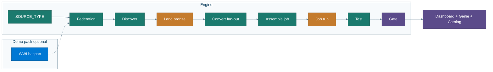

# Architecture

Deep dive for after your first successful run.  
Start with [What you get](what-you-get.md) for plain English; [Enterprise](enterprise.md) for SoD / prod.

---

## Engine vs demo pack

- **Engine:** `SOURCE_TYPE` (`sqlserver`|`mysql`) → Lakehouse Federation → discover base tables (+ procs/routines) → generate bronze land/reconcile → **parallel Convert fan-out** → assemble job from Assess `reads`/`writes` → Test → Gate → Dashboard/Genie.  
- **Demo pack** (`demo/wwi`, `infra/azure`, `legacy/*`): optional WideWorldImporters **source** for [Track A](guided-demo.md). `demo/wwi/reference/` is teaching SQL (not executed, not copied into the job). Gate never requires WWI object names.

**Convert fan-out:** after Assess, `validate_backlog_paths.py` → waves of ≤5 `edw-convert` agents → `merge_convert_results.py` → `check_job_wiring.py --apply` → then deploy/run. Shared memory is disk artifacts under `agents/out/<run_id>/` (orchestrator-worker; land-first Federation — convert reads bronze Delta). See [artifacts map](what-you-get.md#run-artifacts-map).

**Convert vs job tasks:** Gate checks `.sql` files on disk + `ops.proc_conversion_map`. The medallion DAB job is an **engine skeleton** (`federation_smoke` → `bronze_land` → `stage_fixtures` → generated `reconcile` → `lineage_check`). Convert SQL under `databricks/silver|gold` is a run artifact (gitignored). `check_job_wiring.py --apply` inserts those files from Assess `reads`/`writes` and packs peak concurrency ≤ 5. `make reset-sink` restores `edw_migration_medallion.skeleton.yml` and deletes run-local silver/gold SQL. Workspace notebooks are a gallery copy after Land. See [limits.md](limits.md).

**Catalog defaults:** engine `FOREIGN_CATALOG` is `sqlserver_fed` / `mysql_fed` (not a WWI catalog name). Spaced SQL Server table names get alias views from `INFORMATION_SCHEMA`, not a hardcoded list.

Full colored system diagram: [`img/architecture.mmd`](img/architecture.mmd) · Delegation: [`img/agent_delegation.mmd`](img/agent_delegation.mmd)

---

## Catalog model

User supplies `DATABRICKS_CATALOG`. Schemas: `source_fed`, `bronze`, `silver`, `gold`, `ops`.

Foreign catalog mirrors the source via `CONNECTION` `TYPE SQLSERVER` or `TYPE MYSQL`. Password secret: `source-password` (sqlserver also keeps `azure-sql-password` alias).

---

## Discovery

- Tables: `information_schema` on the foreign catalog, `BASE TABLE` only.  
- SQL Server procs: sqlcmd / `export_proc_source.sh`.  
- MySQL routines: `mysql` CLI when present; otherwise `routines_skipped_reason` and table-only Gate.  
- Landing names: `Dimension.X`→`dim_*`, `Fact.X`→`fact_*`, else `schema_table`.

---

## Observability

Observability is **live during the migration**, not only after Gate. Four planes:

1. **Cursor chat** — stage banners + pasted `observe_status.sh` after each stage (`agents/prompts/_live_observability.md`).
2. **UC events** — Cursor hooks + `record_agent_event.sh` → `ops.agent_events`. Control Plane dashboard (`dataset_catalog` / `ops`). Genie with dynamic `table_identifiers`. Gate rule 4 reads this table only (`subagentStart` for assess/convert/test/gate on non-table-only runs). Flush default is 1 event so the timeline updates while Convert runs.
3. **MLflow traces** — live hierarchy in Databricks Experiments (`/Shared/edw-migration`): root `edw.run`, stage spans from milestones, AGENT spans from Cursor `subagentStart`/`Stop`, TOOL spans from shell/MCP/file hooks. Soft no-op until `make observe-setup`. The coordinator announces `observe_url` at mint — open it **while** Convert runs.
4. **Genie** — same `ops.*` tables; useful as soon as inventory/events/backlog rows appear mid-run.

**Subagents:** Assess / Convert / Test / Gate must run as Cursor **`edw-assess` / `edw-convert` / `edw-test` / `edw-gate`** so hooks fire. Opaque Task / `generalPurpose` fan-out is forbidden. Dual_write is **not** a substitute: `merge_convert_results.py` and persist helpers fail closed without hook `subagentStart`.

**MLflow’s role:** live agent/tool span tree while the run executes. It does not replace Control Plane or Genie (those answer ship/fail from `ops.*`).

Paste Control Plane + Genie + Catalog at **Provision** (best-effort) and **Setup**, then `observe_url` at **mint**; **Notebooks** (`edwmigration_YYYYMMDD`) after Land; **Job** after deploy (`announce_observability` / `make print-urls`). Keep them open during the run. Track A provision uses `track_a_provision.sh` in the visible session — not a mute Task. Gate Hero stays empty until Gate — expected. Inventory / backlog / tables-landed widgets move earlier. Stale dashboard: `make reset-sink`. Full Databricks wipe (keeps Azure SQL): `make teardown-databricks`.

Full wiring, hook table, setup, and operator checklist: **[MLflow observability](mlflow.md)**. Entry: type **`start`** — do not invent a migration outside the menu.

---

## Auth

PAT supported now for demos. OAuth (`databricks auth login`) + service principal for jobs is the **enterprise** target — [enterprise.md](enterprise.md).

---

## Free Edition

Serverless warehouse only; Federation not Lakeflow Connect; job concurrency ≤5. Source must be reachable from Free Edition egress — [firewall.md](firewall.md), [limits.md](limits.md), [lakeflow_connect.md](lakeflow_connect.md).

---

## Related

- [Guided demo](guided-demo.md) · [Your database](your-database.md) · [Enterprise](enterprise.md) · [MLflow](mlflow.md) · [Glossary](glossary.md) · [Agents](../agents/README.md) · [Diagrams](img/README.md)
