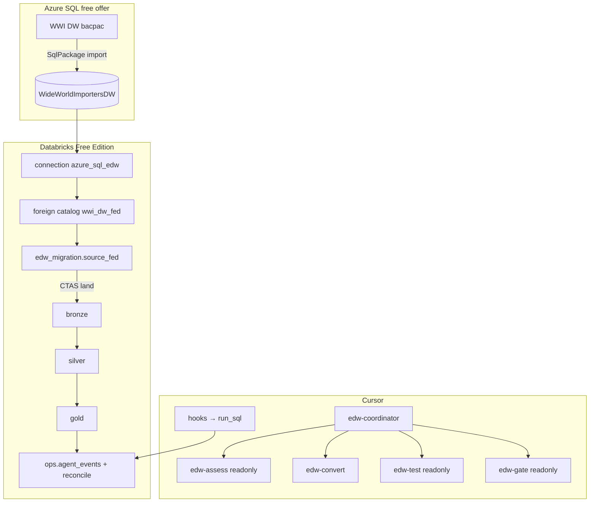
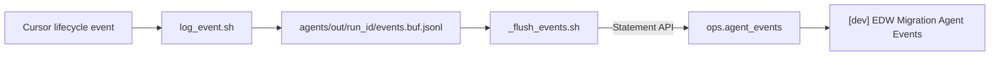

# Architecture

Design of the EDW → Databricks AI-assisted migration demo: source system,
Lakehouse Federation, medallion contracts, Cursor agents, and observability.

PNG: [img/architecture.png](img/architecture.png)

---

## Design principles

1. **$0 demo path** — Azure SQL free offer + Databricks Free Edition only.
2. **Real EDW surface** — WideWorldImportersDW star schema + real
   `Integration.Get*Updates` / `Integration.MigrateStaged*Data` procs
   (not a toy OLTP sample).
3. **Federation, not Lakeflow Connect** — Free Edition has no classic
   clusters; Lakeflow Connect needs a gateway cluster. See
   [lakeflow_connect.md](lakeflow_connect.md).
4. **Coordinator owns writes for readonly stages** — Cursor `readonly` is
   boolean; Assess/Test/Gate return JSON; the coordinator persists artifacts
   and `ops.*` rows.
5. **Baseline medallion stays job-safe** — Convert writes to
   `databricks/converted/` when a silver/gold baseline already exists.
6. **Observability in the product** — hooks → Delta `ops.agent_events` →
   AI/BI dashboard (no local TUI).

---

## Catalog and schema model

| Object | Type | Role |
|---|---|---|
| `wwi_dw_fed` | Foreign catalog | Live Azure SQL via Lakehouse Federation |
| `edw_migration` | Managed catalog | Demo lakehouse |
| `source_fed` | Schema | Thin views over foreign tables (stable names for bronze) |
| `bronze` | Schema | 1:1 land + audit columns |
| `silver` | Schema | Conformed dims/facts, SCD2 customer, orphan quarantine |
| `gold` | Schema | Marts 1:1 with legacy Integration.* outcomes |
| `ops` | Schema | Control, backlog, conversion map, reconcile, agent events, fixtures |

Secrets: Databricks scope `edw-migration` (SQL password for the connection).

---

## Medallion contracts

### Bronze

- Pattern: `CREATE OR REPLACE TABLE … AS SELECT` from `source_fed.*`
- snake_case names; audit columns `_bronze_loaded_at`,
  `_source_system='wwi_azure_sql'`, `_batch_id`
- `ops.load_control` row per load

### Silver

- Conform types and keys (use real WWI keys such as `` `Customer Key` `` /
  `` `Stock Item Key` `` — not synthetic row ids)
- SCD2 on customer; orphan-fact quarantine on sales
- Optional PK/FK + collation via `23_constraints_and_collation.sql`

### Gold

| Gold table / metric | Replaces (conceptually) | Pattern |
|---|---|---|
| `mart_daily_internet_sales` | Get*Updates + aggregation | CTAS daily grain |
| `mart_stock_movements` | MigrateStagedStockItemData | INSERT OVERWRITE snapshot |
| `mart_customer_current` | MigrateStagedCustomerData | current-state snapshot |
| `mart_city_dimension` | GetCityUpdates | CTAS |
| metric view (daily sales) | BI consumption | UC metric view |

### Reconcile

- Fixtures from Azure after running Integration.* procs → CSV +
  `expectations.json`
- Job stages expectations → `ops.fixture_expectations`
- `reconcile.sql` writes pass/fail rows to `ops.reconcile_results`
- `04_lineage_check.sql` sanity-checks UC lineage after reconcile

---

## Agent system

Delegation graph: [img/agent_delegation.png](img/agent_delegation.png)

| Stage | Subagent | Writable? | Output |
|---|---|---|---|
| Orchestrate | `edw-coordinator` | `agents/out/<run_id>/`, `CURRENT_RUN` | drives pipeline + retry budget |
| Assess | `edw-assess` | no (returns JSON) | `migration_backlog` |
| Convert | `edw-convert` | `databricks/converted/` (+ silver/gold if no baseline) | notebook + mapping notes |
| Test | `edw-test` | no (returns JSON) | `reconcile_report` |
| Gate | `edw-gate` | no (returns JSON) | `migration_manifest` |

Portable prompts live in `agents/prompts/`; Cursor subagents in
`.cursor/agents/` are generated by `agents/tools/sync_prompts.sh`.

Contracts (JSON Schema): `agents/contracts/*.schema.json`.

---

## Observability (hooks → UC → AI/BI)

- Hooks schema: Cursor `version: 1` **arrays** in `.cursor/hooks.json`
- `run_id` resolution: `agents/out/CURRENT_RUN` (not in Cursor payloads)
- Logging hooks: `failClosed: false` (buffer on disk if flush fails)
- `subagentStop`: `failClosed: true` — on Gate fail + retries left, emit
  `followup_message` to re-delegate Convert
- Dashboard deployed by DAB (`databricks/jobs/dashboard.yml` +
  `databricks/dashboards/agent_events.lvdash.json`)

---

## Free Edition constraints that shaped the design

| Constraint | Design response |
|---|---|
| No classic clusters | Lakehouse Federation on serverless SQL warehouse |
| Max 5 concurrent job tasks | Job DAG fans out but peak concurrency ≤ 5 |
| Restricted egress | Azure SQL on trusted domain; firewall `0.0.0.0/0` for demo only |
| No `databricks sql execute` | `agents/tools/run_sql.sh` → Statement Execution API |
| DAB warehouse binding | `BUNDLE_VAR_warehouse_id` + `targets.dev` |

Full list: [limits.md](limits.md).

---

## What is intentionally out of scope

CDC / streaming, production SLAs and alerting, multi-region DR, classic
cluster patterns, and Lakeflow Connect. See [limits.md](limits.md).
