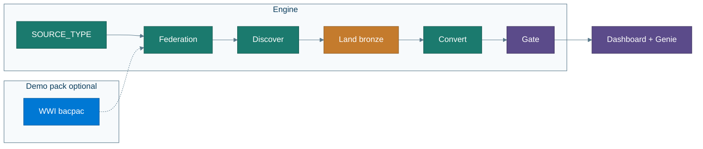

# Architecture

Deep dive for after your first successful run.  
Start with [What you get](what-you-get.md) for plain English; [Enterprise](enterprise.md) for SoD / prod.

---

## Engine vs demo pack

- **Engine:** `SOURCE_TYPE` (`sqlserver`|`mysql`) → Lakehouse Federation → discover base tables (+ procs/routines) → generate bronze land/reconcile → agent Convert → job → Gate → Dashboard/Genie.  
- **Demo pack** (`demo/wwi`, `infra/azure`, `legacy/*`): optional WideWorldImporters sample for [Track A](guided-demo.md). Gate never requires WWI object names.

Full colored system diagram: [`img/architecture.mmd`](img/architecture.mmd)

---

## Catalog model

User supplies `DATABRICKS_CATALOG`. Schemas: `source_fed`, `bronze`, `silver`, `gold`, `ops`.

Foreign catalog mirrors the source via `CONNECTION` `TYPE SQLSERVER` or `TYPE MYSQL`. Password secret: `source-password` (sqlserver also keeps `azure-sql-password` alias).

---

## Discovery

- Tables: `information_schema` on the foreign catalog, `BASE TABLE` only.  
- SQL Server procs: sqlcmd / `export_proc_source.sh`.  
- MySQL routines: `mysql` CLI when present; otherwise `routines_skipped_reason` and table-only Gate.  
- Landing names: `Dimension.X`→`dim_*`, `Fact.X`→`fact_*`, else `schema_table`.

---

## Observability

Hooks → `ops.agent_events`. Control Plane dashboard (`dataset_catalog` / `ops`). Genie with dynamic `table_identifiers`. Print links with `make print-urls`.

---

## Auth

PAT supported now for demos. OAuth (`databricks auth login`) + service principal for jobs is the **enterprise** target — [enterprise.md](enterprise.md).

---

## Free Edition

Serverless warehouse only; Federation not Lakeflow Connect; job concurrency ≤5. Source must be reachable from Free Edition egress — [firewall.md](firewall.md), [limits.md](limits.md), [lakeflow_connect.md](lakeflow_connect.md).

---

## Related

- [Guided demo](guided-demo.md) · [Your database](your-database.md) · [Enterprise](enterprise.md) · [Glossary](glossary.md) · [Agents](../agents/README.md) · [Diagrams](img/README.md)
