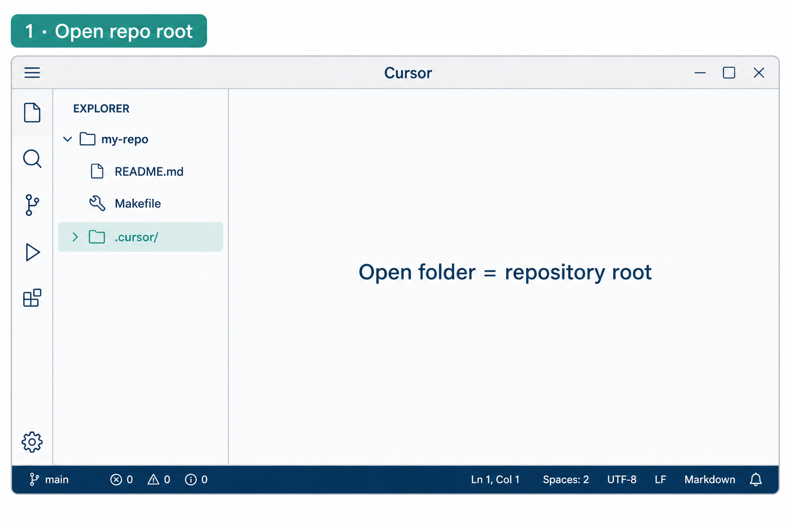
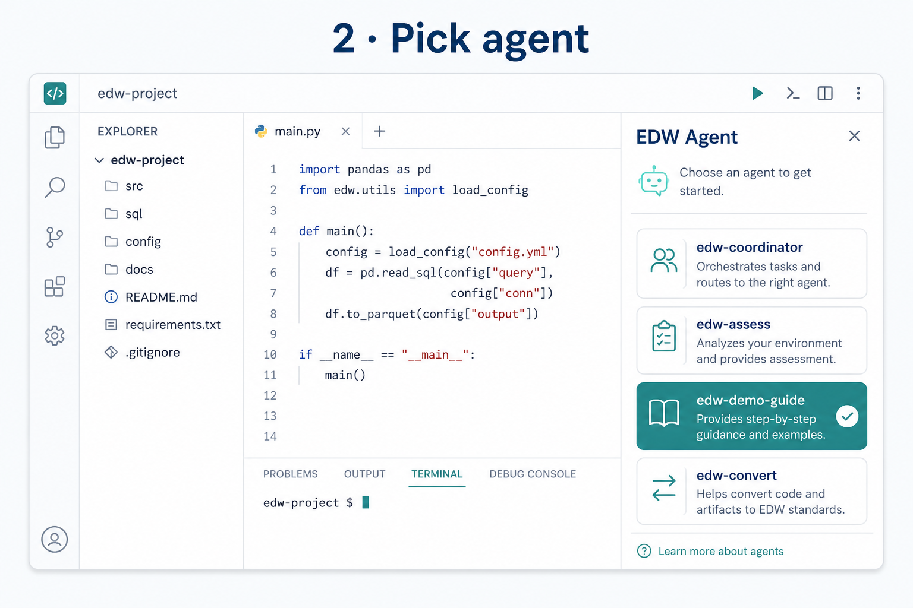
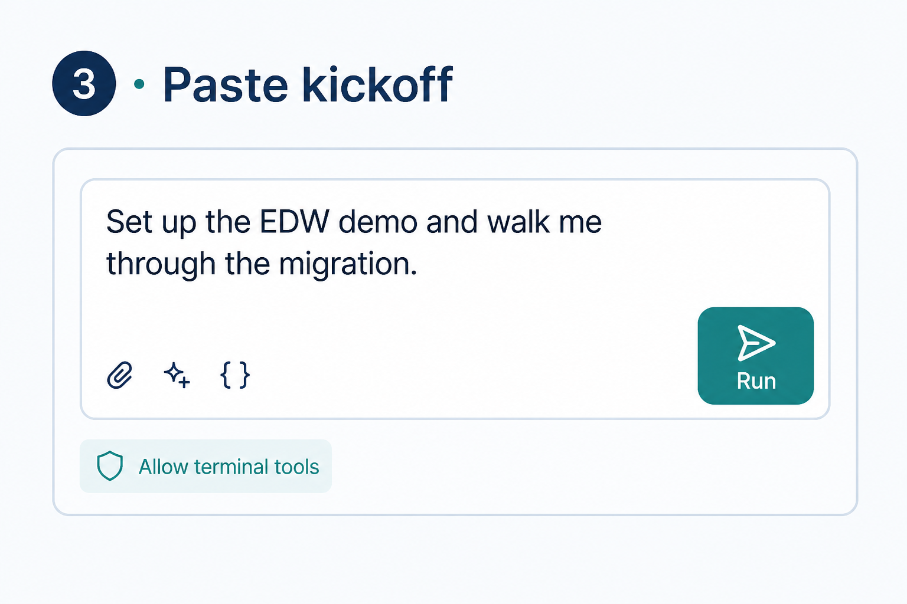

# Using Cursor with this repo

You do not need prior Cursor-agent experience. Follow these three screens, then paste a [kickoff sentence](agent-setup.md).

← [Getting started](getting-started.md) · [Agent setup](agent-setup.md)

---

## 1. Open the repository root

**File → Open Folder…** and choose the folder that contains `README.md`, `Makefile`, and `.cursor/` — not a subfolder.

If you open a nested folder, agents under `.cursor/agents/` may not load.

---

## 2. Pick the agent

Open **Chat** or **Agent** mode. Select or mention:

- **`edw-demo-guide`** for the [guided demo](guided-demo.md)  
- **`edw-coordinator`** for [your database](your-database.md)  

Missing agents? Run `make sync-prompts` at the repo root, then reload the window.

---

## 3. Paste the kickoff sentence

Example (Track A):

> Set up the EDW demo and walk me through the migration.

Allow terminal / tool use when Cursor asks so the agent can run `make` and repo scripts.

---

## What good looks like (first 10 minutes)

- Agent verifies logins or tells you the one missing command  
- It writes or updates `.env`  
- Later it prints **Control Plane** and **Genie** URLs (`make print-urls`)  

Full walkthrough: [guided-demo.md](guided-demo.md) · Copilot: [agent-setup.md](agent-setup.md#github-copilot)

---

## UI labels move

Cursor renames Chat / Agent panels between versions. The idea stays: **open repo root → select named agent → paste kickoff → allow tools**.
