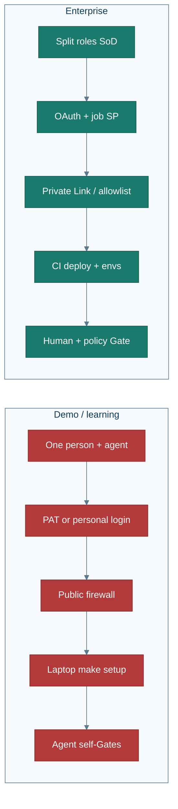
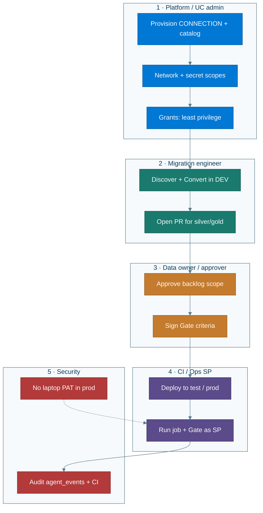

# Enterprise

**After the guided demo:** what must change before this pattern is acceptable in a real organization with segregation of duties (SoD).

← [Guided demo](guided-demo.md) · [Architecture](architecture.md) · [Glossary](glossary.md)

The learning path (one person + agent + Free Edition) is intentional. **It is not an enterprise operating model.** This page is the bridge.

---

## What must change (demo → enterprise)

| Area | Demo today | Enterprise need |
|---|---|---|
| **Auth** | PAT / personal CLI profile | User OAuth + **service principal** for jobs; no long-lived PATs in laptop `.env` for prod |
| **Network** | Temporary `0.0.0.0/0` for Free Edition | Private Link / VNet / allowlisted egress — see [firewall.md](firewall.md) |
| **Secrets** | Local `.env` + secret scope | Vault-backed secrets; rotate; never paste passwords into chat for prod |
| **Privileges** | One admin creates CONNECTION + CATALOG | Split: metastore admin grants; project SP owns catalog; analysts get SELECT |
| **Discovery** | Full-auto all visible tables | Scoped schemas / allowlists; mandatory confirm; classify PII before land |
| **Convert** | Agent writes silver/gold in-repo | Pull request review; Convert ≠ Deploy |
| **Gate** | Agent interprets ship / no-ship | Gate as **policy** (CI + required reviewers); no self-approve prod |
| **Environments** | Single `dev` catalog | `dev` → `test` → `prod` catalogs + promotion |
| **Compute** | Free Edition serverless | Governed warehouses; job runs as SP |
| **Observability** | Dashboard + Genie for one user | Audit retention; who may query prod `ops.*` |
| **Change control** | `make setup` from laptop | Bundle deploy via CI; no prod deploy from a Cursor session |

---

## Segregation of duties

Roles that **must not** collapse into one Cursor user with admin + PAT:

| Role | May | Must not |
|---|---|---|
| **Requester / analyst** | Ask for migration; review Genie in non-prod | Create CONNECTION; declare Gate pass |
| **Platform / UC admin** | Grant privileges; network; create catalogs | Alone approve business Gate or edit conversions |
| **Migration engineer** | Discover / Convert in **dev**; open PRs | Deploy to prod; hold metastore admin |
| **Data owner / approver** | Sign off backlog scope + Gate criteria | Hold deploy credentials |
| **Ops / SRE** | Run prod job as SP; monitor | Change conversion SQL without PR |
| **Security** | Secrets, firewall, audit | Own the business ship decision |

**Demo anti-pattern (call this out in reviews):** one human + `edw-coordinator` + admin + PAT + public firewall = **no SoD**. Fine for learning; non-compliant for enterprise.

### SoD sequence

Sources also live in [`img/enterprise_sod.mmd`](img/enterprise_sod.mmd) and [`img/demo_vs_enterprise.mmd`](img/demo_vs_enterprise.mmd).

---

## Recommended enterprise run order

1. **Platform** provisions connection, catalog, network, and grants (often **without** the agent).  
2. **Engineer** runs Assess / Convert in **dev** (agent OK).  
3. **PR review** of silver/gold SQL.  
4. **Data owner** approves backlog scope and Gate criteria.  
5. **CI** deploys and runs Test in **test**.  
6. **Separate promotion** to **prod** as a service principal; Gate re-run.  
7. **Security** audits `ops.agent_events`, CI logs, and UC history.

---

## What we still promise

| Keep | Drop for enterprise |
|---|---|
| Discovery → land → convert → reconcile → Gate model | Free Edition + public firewall as the path |
| Control Plane + Genie as the explainer | Laptop PAT as prod identity |
| Inventory-driven (no hard-coded WWI names) | One person who creates, converts, deploys, and Gates |

Auth note in-engine today: PAT works for demos; **OAuth + SP is the enterprise target** ([architecture.md](architecture.md), [limits.md](limits.md)).

---

## RACI (summary)

| Activity | Platform | Engineer | Owner | CI/Ops | Security |
|---|---|---|---|---|---|
| Create CONNECTION / catalog | **A/R** | C | I | I | C |
| Discover / Convert (dev) | I | **R** | C | I | I |
| Approve backlog / Gate policy | I | C | **A** | I | C |
| Deploy prod job | I | C | I | **R** | C |
| Audit | I | I | I | C | **A/R** |

*(R = responsible, A = accountable, C = consulted, I = informed)*

---

## Next

- Still learning? → [Guided demo](guided-demo.md)  
- Point at a real DB in a sandbox → [Your database](your-database.md) (use non-prod + locked firewall)  
- Terms → [Glossary](glossary.md)  
- Engine depth → [Architecture](architecture.md)
