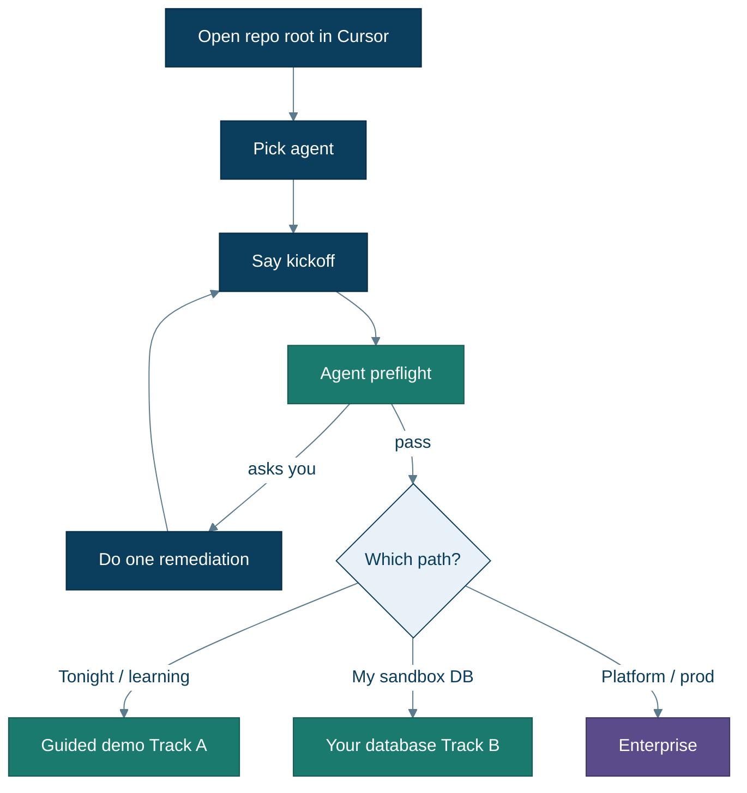
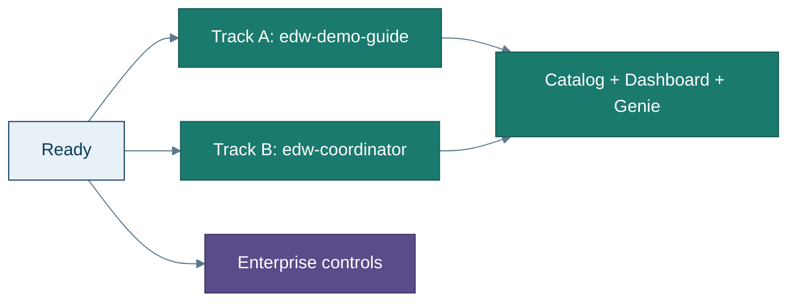

# Getting started

**Goal:** Open this repo in Cursor, say one kickoff sentence, and fix **only** what the agent reports.

You do **not** need prior EDW or Unity Catalog experience. You do **not** need to run version checks or log in before chatting — the agent’s preflight tells you the next human action.

**Prefer pictures?** → **[Using Cursor](cursor-ui.md)** · **New words?** → [Glossary](glossary.md)

---

## 1. Open the repo the right way

1. Clone the repository (or download it).
2. In Cursor: **File → Open Folder…** and choose the **repository root** (the folder that contains `README.md`, `Makefile`, and `.cursor/`).

**Why the root matters:** Cursor loads [`.cursor/agents/`](../.cursor/agents/) and hooks from the folder you open. If you open a subfolder, agents may not appear. Step-by-step visuals: [cursor-ui.md](cursor-ui.md).

---

## 2. What is a “Cursor agent” here?

This repo ships **specialized chat agents** with names like `edw-demo-guide` and `edw-coordinator`. Each one has instructions for one job (demo walkthrough, full migration run, convert one procedure, Gate, etc.).

**How to use them:** see **[Using Cursor](cursor-ui.md)** (three screenshots), or:

1. Open Agent / Chat in Cursor.  
2. Pick **`edw-demo-guide`** (demo) or **`edw-coordinator`** (your DB).  
3. Paste the **kickoff sentence** (next section).  
4. Allow tools; when preflight fails, do the one remediation it prints, then say **continue**.

If agents are missing: `make sync-prompts`, then reload the window.

**GitHub Copilot users:** [`agents/github-copilot/`](../agents/github-copilot/) · [`.github/copilot-instructions.md`](../.github/copilot-instructions.md).

---

## 3. Say the kickoff (primary step)

| Path | Agent | Say |
|---|---|---|
| **A — Guided demo** | `edw-demo-guide` | Set up the EDW demo and walk me through the migration. |
| **B — MySQL** | `edw-coordinator` | Migrate my Azure MySQL into catalog `<name>`. Host/user/db are in `.env` (or I’ll paste them). |
| **B — Azure SQL** | `edw-coordinator` | Start an EDW migration run against my Azure SQL. |

For Track A, the guide runs `./agents/tools/preflight_track_a.sh` first (tools, Azure/Databricks auth, SQL warehouse). It stops with a clear remediation if something is missing. Full walkthrough: **[Guided demo](guided-demo.md)**.

---

## 4. When the agent asks

Do **only** the action it names. Common remediations:

| Agent says | You do |
|---|---|
| Azure not logged in | `az login` |
| Databricks not authenticated | `databricks auth login --host https://<your-workspace>.cloud.databricks.com` (or set `DATABRICKS_TOKEN`) |
| No SQL warehouse | Create a **serverless** warehouse in the Databricks UI, then say continue |
| Install Azure CLI / Databricks CLI / python3 / jq / SqlPackage / sqlcmd | See **[prerequisites.md](prerequisites.md)** — Track A preflight **FAIL**s until SqlPackage + sqlcmd are present |
| `CREATE CONNECTION` denied | Ask a workspace admin for `CREATE CONNECTION` + `CREATE CATALOG` (or run as admin) |

Logins are interactive (MFA). The agent cannot complete them for you.

Track B uses the same loop: kickoff → agent asks for Databricks login / `.env` fields if needed.

---

## 5. Choose your path (detail)

| Path | Best when | Next page |
|---|---|---|
| **A — Guided demo** | First time, $0 sample DW, learn the flow | **[Guided demo](guided-demo.md)** |
| **B — Your database** | Sandbox Azure SQL or Azure MySQL | **[Your database](your-database.md)** |
| **Enterprise** | Platform / security / prod readiness | **[Enterprise](enterprise.md)** |

---

## 6. What “success” feels like in the first session

- Agent prints **Control Plane** and **Genie** URLs (`make print-urls`).  
- You can open the dashboard and ask Genie: *Did the last run ship?*  
- For the demo: Gate aims for **≥10 tables** and **≥5 procedures** (counts, not hard-coded names).  

If something fails: **[troubleshooting.md](troubleshooting.md)**.

---

## Next

→ **[Using Cursor](cursor-ui.md)** · **[What you get](what-you-get.md)** · **[Guided demo](guided-demo.md)**
