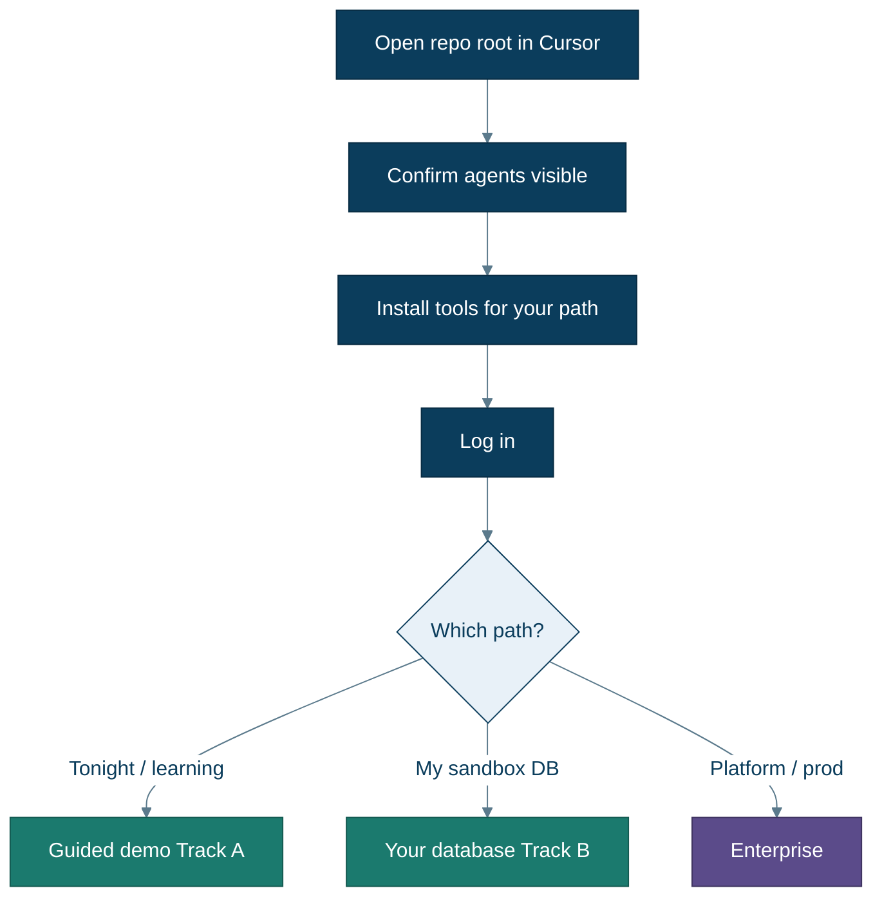
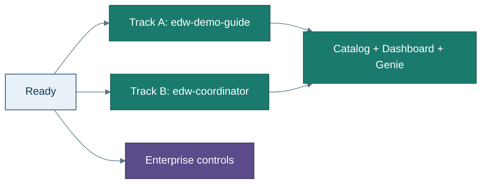

# Getting started

**Goal:** Open this repo in Cursor so the migration agents load, log in once, and know which path to take.

You do **not** need prior EDW or Unity Catalog experience. Follow this page top to bottom the first time; later skip to [Guided demo](guided-demo.md) or [Your database](your-database.md).

**Prefer pictures?** → **[Using Cursor](cursor-ui.md)** · **New words?** → [Glossary](glossary.md)



---

## 1. Open the repo the right way

1. Clone the repository (or download it).
2. In Cursor: **File → Open Folder…** and choose the **repository root** (the folder that contains `README.md`, `Makefile`, and `.cursor/`).


**Why the root matters:** Cursor loads [`.cursor/agents/`](../.cursor/agents/) and hooks from the folder you open. If you open a subfolder, agents may not appear. Step-by-step visuals: [cursor-ui.md](cursor-ui.md).

---

## 2. What is a “Cursor agent” here?

This repo ships **specialized chat agents** with names like `edw-demo-guide` and `edw-coordinator`. Each one has instructions for one job (demo walkthrough, full migration run, convert one procedure, Gate, etc.).

**How to use them:** see **[Using Cursor](cursor-ui.md)** (three illustrations), or:

1. Open Agent / Chat in Cursor.  
2. Pick **`edw-demo-guide`** (demo) or **`edw-coordinator`** (your DB).  
3. Paste the **kickoff sentence** from [agent-setup.md](agent-setup.md).  
4. Allow tools; answer when it asks (for example confirm >200 tables).

If agents are missing: `make sync-prompts`, then reload the window.

**GitHub Copilot users:** [`agents/github-copilot/`](../agents/github-copilot/) · [`.github/copilot-instructions.md`](../.github/copilot-instructions.md).

---

## 3. Tools to install

| Always | Track A (guided demo) | Track B (your DB) |
|---|---|---|
| [Cursor](https://cursor.com) (or Copilot) | Azure CLI (`az`) | Databricks CLI |
| Databricks CLI | SqlPackage + sqlcmd *(agent uses these; you don’t run them by hand)* | python3, jq, curl |
| python3, jq, curl | Databricks CLI + python3… | Optional: `az` (firewall), `mysql` client (routines only) |

Full matrix and privileges: **[prerequisites.md](prerequisites.md)**.

Quick checks:

```bash
databricks --version
python3 --version
jq --version
# Track A also:
az account show
```

---

## 4. Log in

### Guided demo (Track A) — do both

```bash
az login
databricks auth login --host https://<your-workspace>.cloud.databricks.com
```

Or set a Databricks PAT in `.env` later (`DATABRICKS_TOKEN`) if you prefer.

You need a **serverless SQL warehouse** in the workspace (Free Edition is fine). Create one in the Databricks UI if the agent says none exist.

### Your own database (Track B)

```bash
databricks auth login --host https://<your-workspace>.cloud.databricks.com
```

`az login` only if you want the agent to help open a firewall rule.

---

## 5. Choose your path

| Path | Best when | Next page |
|---|---|---|
| **A — Guided demo** | First time, $0 sample DW, learn the flow | **[Guided demo](guided-demo.md)** |
| **B — Your database** | Sandbox Azure SQL or Azure MySQL | **[Your database](your-database.md)** |
| **Enterprise** | Platform / security / prod readiness | **[Enterprise](enterprise.md)** |



---

## 6. What “success” feels like in the first session

- Agent prints **Control Plane** and **Genie** URLs (`make print-urls`).  
- You can open the dashboard and ask Genie: *Did the last run ship?*  
- For the demo: Gate aims for **≥10 tables** and **≥5 procedures** (counts, not hard-coded names).  

If something fails: **[troubleshooting.md](troubleshooting.md)**.

---

## Next

→ **[Using Cursor](cursor-ui.md)** · **[What you get](what-you-get.md)** · **[Guided demo](guided-demo.md)**
