# Guided demo (Track A)

**The recommended first experience.** About an hour the first time. Uses free Azure SQL + Databricks Free Edition sample data. An agent does the heavy lifting; you watch and confirm — and fix **only** what preflight asks.

**Verified:** Track A path checked against Databricks Free Edition patterns (preflight → bootstrap → migration → URLs). Demo acceptance counts (≥10 tables / ≥5 procs) depend on a full run on *your* tenant — those counts are checked by the guide, not by Gate.

← [Getting started](getting-started.md) · [Using Cursor](cursor-ui.md) · [What you get](what-you-get.md) · **[MLflow](mlflow.md)** · Stuck? [Troubleshooting](troubleshooting.md)

```mermaid
%%{init: {"theme":"base","themeVariables":{"primaryColor":"#E8F1F8","primaryTextColor":"#0B3D5C","primaryBorderColor":"#0B3D5C","lineColor":"#5B7A8C","secondaryColor":"#E6F4F1","tertiaryColor":"#F7F3EA","background":"#FFFFFF","mainBkg":"#E8F1F8","clusterBkg":"#F7FAFC","clusterBorder":"#5B7A8C","titleColor":"#0B3D5C","edgeLabelBackground":"#FFFFFF"}}}%%
flowchart LR
  O[Open repo root] --> G[Type start or edw-demo-guide]
  G --> S[Choose 1 or paste kickoff]
  S --> F[Fix if agent asks]
  F --> W[Watch Control Plane Catalog Job Notebooks Genie MLflow]
  W --> T[Teardown when done]
  classDef user fill:#0B3D5C,stroke:#082C43,color:#fff
  classDef agent fill:#1B7A6E,stroke:#145A51,color:#fff
  classDef ops fill:#5B4B8A,stroke:#3F3460,color:#fff
  class O,S,F user
  class G agent
  class W,T ops
```



---

## Before you start

You only need:

- Repo opened at the **git root** in **Cursor** (hooks need Cursor, not VS Code alone)  
- Agents **`edw-start`** / **`edw-demo-guide`** visible (else `make sync-prompts`, reload)  
- **Recommended for live traces:** `make observe-setup` once (preflight WARNs if missing; migration still continues). Write-up: **[MLflow observability](mlflow.md)**.

Warehouse, Azure/Databricks login, and tools: the guide runs `./agents/tools/preflight_track_a.sh` and **asks** if something is missing. Privileges (`CREATE CONNECTION` / `CREATE CATALOG`) are checked when wiring the sink — see [prerequisites](prerequisites.md) if the agent reports a deny.

---

## Run it (human path)

1. In Cursor, type **`start`** (or launch **`edw-demo-guide`**).  
2. Choose menu **1**, or paste:

   > Set up the EDW demo and walk me through the migration.

3. Allow tools. The guide runs **preflight** first. If it stops with a `FAIL` line, do that one action (for example `az login`), then say **continue**.  
4. After preflight passes, the guide will roughly:
   - Write `.env` (`materialize_demo_env`)  
   - Bootstrap free Azure SQL + WideWorldImporters sample (`make bootstrap`)  
   - Wire federation, dashboard, Genie (`make setup`)  
   - Drive the coordinator with checkpoints: Assess → **Convert wave** (≤5 in parallel) → merge → Test → Gate  
5. Watch live (open links **once**, leave them open):
   - Open **Control Plane**, **Genie**, **Catalog**, and MLflow **`observe_url`** when the guide prints them (**Provision** best-effort, **Setup**, then **Mint** for `observe_url`). After Land, open **Notebooks**; after deploy, open **Job**. Leave tabs open; watch chat `[edw]` heartbeats during bootstrap.
   - In chat, expect `observe_status` after each stage — not another URL dump.
   - Assess / Convert / Test / Gate should run as Cursor **`edw-*`** agents (hooks feed the Dashboard + MLflow).
   - Ask Genie mid-run about inventory/events; after Gate: *Did the last run ship?*  
   Details: **[MLflow observability](mlflow.md)**.
6. Demo acceptance (guide check, **not** a Gate rule): **≥10 tables** and **≥5 procedures** migrated (counts only).  
7. When finished: ask the guide to tear down (menu **5**). Databricks-only (keeps Azure SQL): `make teardown-databricks`. Azure RG: `make teardown`. Between demos without tearing down Azure: confirm `make reset-sink` when offered (stale dashboard from a prior demo).

### Live acceptance checklist (`start` → **1** / **2** / **3**)

During Assess/Convert you should see all of these for **this** `run_id`:

1. Chat pastes `observe_status` counts moving after each stage  
2. Control Plane **Latest Events** for this `run_id`  
3. MLflow **AGENT** spans for assess/convert (and later test/gate)  
4. Genie able to talk about inventory / events mid-run  

Gate Hero stays empty until Gate — expected. Inventory / Events / Backlog should populate earlier.

**Job wiring (plain English):** Gate checks that converted notebooks exist on disk. The medallion job runs a **checked-in** task list — for the WWI demo that already covers the sample. If the guide prints a job-wiring WARN on a custom conversion, it can propose/apply a safe YAML patch (`check_job_wiring.py --apply`) so the new notebook becomes a job task without exceeding Free Edition concurrency ([limits.md](limits.md)).

What you will see at each pause: **[What you will see while it works](what-you-get.md#what-you-will-see-while-it-works)**.


---

## Definition of done (Track A)

You can stop and celebrate when **all** of these are true:

1. Control Plane, Genie, and Catalog URLs open early (`announce_observability` / `make print-urls` at Provision/Setup); **Notebooks** (`edwmigration_YYYYMMDD`) after Land; **Job** after deploy  
2. Genie can answer *Did the last run ship?*  
3. Gate summary shows ship (empty blockers)  
4. Demo acceptance counts: **≥10** bronze tables and **≥5** converted procs *(guide check, not Gate)*  
5. **MLflow (recommended):** you ran `make observe-setup` once, and opened `observe_url` **when minted** (watched during Convert, not only at the end)  
6. You tore down Databricks (`make teardown-databricks`) and/or Azure (`make teardown` / menu **5**) **or** consciously kept them / used `make reset-sink` for a follow-up  

---

## Scripted twin (CI / SE laptop)

If you prefer Makefile over chat for infra only:

```bash
make materialize-demo
make provision-track-a   # or: make demo (announce → bootstrap → setup)
```

Then still open Cursor, type **`start`** → **1**, and continue the migration walkthrough in the **visible** chat (Assess/Convert/Test/Gate as `edw-*`). Prefer the guide’s preflight for first runs.

---

## What the firewall warning means

Bootstrap opens temporary public access so **Free Edition** (AWS-hosted) can reach Azure SQL. That is intentional for the **sample** database only. Tear down when done. Details: [firewall.md](firewall.md).

---

## If the agent told you something failed

| Agent / preflight says | One-line fix |
|---|---|
| Azure not logged in | `az login` |
| Databricks auth fails | `databricks auth login --host …` or set `DATABRICKS_TOKEN` |
| No warehouse | Create a serverless SQL warehouse, say continue |
| `CREATE CONNECTION` denied | Need metastore privilege or admin |
| Cold / paused SQL | Wait and retry; free DB auto-pauses |
| SqlPackage / sqlcmd missing | Install once — preflight **FAIL** until present ([prerequisites](prerequisites.md)) |

More: **[troubleshooting.md](troubleshooting.md)** · Azure RBAC: [azure-access-unblocking.md](azure-access-unblocking.md)

---

## After the demo

- Curious how layers work → [What you get](what-you-get.md) / [Architecture](architecture.md)  
- Ready for a sandbox DB → **[Your database](your-database.md)**  
- Platform / security / prod → **[Enterprise](enterprise.md)**  
- Power-user checklist → [Runbook](runbook.md)
