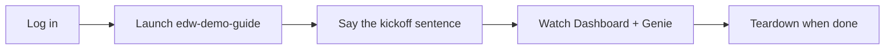
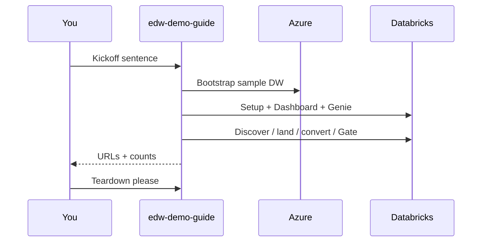

# Guided demo (Track A)

**The recommended first experience.** About an hour the first time. Uses free Azure SQL + Databricks Free Edition sample data. An agent does the heavy lifting; you watch and confirm.

← [Getting started](getting-started.md) · [What you get](what-you-get.md) · Stuck? [Troubleshooting](troubleshooting.md)



---

## Before you start

Complete **[Getting started](getting-started.md)** through logins:

```bash
az login
databricks auth login --host https://<your-workspace>.cloud.databricks.com
```

You need:

- Repo opened at the **git root** in Cursor  
- Agent **`edw-demo-guide`** visible (else `make sync-prompts`)  
- A **serverless** SQL warehouse in Databricks  
- Privilege to `CREATE CONNECTION` and `CREATE CATALOG` (or admin) — see [prerequisites](prerequisites.md)

---

## Run it (human path)

1. In Cursor, start **`edw-demo-guide`**.  
2. Paste this kickoff sentence:

   > Set up the EDW demo and walk me through the migration.

3. The guide will roughly:
   - Verify Azure + Databricks auth  
   - Write `.env` (`materialize_demo_env`)  
   - Bootstrap free Azure SQL + WideWorldImporters sample (`make bootstrap`)  
   - Wire federation, dashboard, Genie (`make setup`)  
   - Drive the coordinator with checkpoints (Assess → Convert → Test → Gate)  
4. When it prints URLs, open **Control Plane** and **Genie**. Ask: *Did the last run ship?*  
5. Demo acceptance: **≥10 tables** and **≥5 procedures** migrated (counts only).  
6. When finished: ask the guide to tear down, or run `make teardown`.



---

## Scripted twin (CI / SE laptop)

If you prefer Makefile over chat for infra only:

```bash
make materialize-demo
make demo
```

Then still open Cursor and use **`edw-demo-guide`** or **`edw-coordinator`** for the migration walkthrough.

---

## What the firewall warning means

Bootstrap opens temporary public access so **Free Edition** (AWS-hosted) can reach Azure SQL. That is intentional for the **sample** database only. Tear down when done. Details: [firewall.md](firewall.md).

---

## If something fails

| Symptom | One-line fix |
|---|---|
| Azure not logged in | `az login` |
| Databricks auth fails | `databricks auth login --host …` or set `DATABRICKS_TOKEN` |
| No warehouse | Create a serverless SQL warehouse, re-run |
| `CREATE CONNECTION` denied | Need metastore privilege or admin |
| Cold / paused SQL | Wait and retry; free DB auto-pauses |

More: **[troubleshooting.md](troubleshooting.md)**

---

## After the demo

- Curious how layers work → [What you get](what-you-get.md) / [Architecture](architecture.md)  
- Ready for real data → **[Your database](your-database.md)**  
- Power-user checklist → [Runbook](runbook.md)
