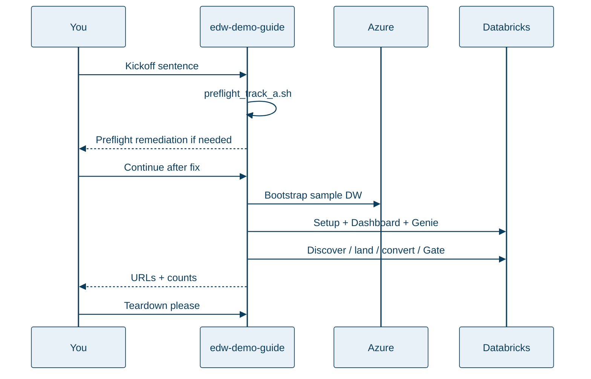

# Guided demo (Track A)

**The recommended first experience.** About an hour the first time. Uses free Azure SQL + Databricks Free Edition sample data. An agent does the heavy lifting; you watch and confirm — and fix **only** what preflight asks.

**Verified:** Track A tooling and docs path checked against Databricks Free Edition workspace patterns; agent protocol includes Parallel Convert fan-out and kickoff-first preflight as of **2026-08-08** (CI dual-render, `make print-urls` / Control Plane + Genie discovery). Your Gate counts still depend on a full bootstrap + migration on *your* tenant.

← [Getting started](getting-started.md) · [Using Cursor](cursor-ui.md) · [What you get](what-you-get.md) · Stuck? [Troubleshooting](troubleshooting.md)

```mermaid
%%{init: {"theme":"base","themeVariables":{"primaryColor":"#E8F1F8","primaryTextColor":"#0B3D5C","primaryBorderColor":"#0B3D5C","lineColor":"#5B7A8C","secondaryColor":"#E6F4F1","tertiaryColor":"#F7F3EA","background":"#FFFFFF","mainBkg":"#E8F1F8","clusterBkg":"#F7FAFC","clusterBorder":"#5B7A8C","titleColor":"#0B3D5C","edgeLabelBackground":"#FFFFFF"}}}%%
flowchart LR
  O[Open repo root] --> G[Launch edw-demo-guide]
  G --> S[Say the kickoff]
  S --> F[Fix if agent asks]
  F --> W[Watch Dashboard + Genie]
  W --> T[Teardown when done]
  classDef user fill:#0B3D5C,stroke:#082C43,color:#fff
  classDef agent fill:#1B7A6E,stroke:#145A51,color:#fff
  classDef ops fill:#5B4B8A,stroke:#3F3460,color:#fff
  class O,S,F user
  class G agent
  class W,T ops
```



---

## Before you start

You only need:

- Repo opened at the **git root** in Cursor  
- Agent **`edw-demo-guide`** visible (else `make sync-prompts`, reload)

Warehouse, Azure/Databricks login, and tools: the guide runs `./agents/tools/preflight_track_a.sh` and **asks** if something is missing. Privileges (`CREATE CONNECTION` / `CREATE CATALOG`) are checked when wiring the sink — see [prerequisites](prerequisites.md) if the agent reports a deny.

---

## Run it (human path)

1. In Cursor, start **`edw-demo-guide`**.  
2. Paste this kickoff sentence:

   > Set up the EDW demo and walk me through the migration.

3. Allow tools. The guide runs **preflight** first. If it stops with a `FAIL` line, do that one action (for example `az login`), then say **continue**.  
4. After preflight passes, the guide will roughly:
   - Write `.env` (`materialize_demo_env`)  
   - Bootstrap free Azure SQL + WideWorldImporters sample (`make bootstrap`)  
   - Wire federation, dashboard, Genie (`make setup`)  
   - Drive the coordinator with checkpoints: Assess → **Convert wave** (≤5 in parallel) → merge → Test → Gate  
5. When it prints URLs, open **Control Plane** and **Genie**. Ask: *Did the last run ship?*  
6. Demo acceptance: **≥10 tables** and **≥5 procedures** migrated (counts only).  
7. When finished: ask the guide to tear down, or run `make teardown`.

What you will see at each pause: **[What you will see while it works](what-you-get.md#what-you-will-see-while-it-works)**.



---

## Definition of done (Track A)

You can stop and celebrate when **all** of these are true:

1. Control Plane and Genie URLs open (`make print-urls`)  
2. Genie can answer *Did the last run ship?*  
3. Gate summary shows ship (empty blockers)  
4. Counts: **≥10** bronze tables and **≥5** converted procs *(counts only)*  
5. You tore down Azure resources (`make teardown`) **or** consciously kept them for a follow-up  

---

## Scripted twin (CI / SE laptop)

If you prefer Makefile over chat for infra only:

```bash
make materialize-demo
make demo
```

Then still open Cursor and use **`edw-demo-guide`** or **`edw-coordinator`** for the migration walkthrough. Prefer the guide’s preflight + kickoff for first runs.

---

## What the firewall warning means

Bootstrap opens temporary public access so **Free Edition** (AWS-hosted) can reach Azure SQL. That is intentional for the **sample** database only. Tear down when done. Details: [firewall.md](firewall.md).

---

## If the agent told you something failed

| Agent / preflight says | One-line fix |
|---|---|
| Azure not logged in | `az login` |
| Databricks auth fails | `databricks auth login --host …` or set `DATABRICKS_TOKEN` |
| No warehouse | Create a serverless SQL warehouse, say continue |
| `CREATE CONNECTION` denied | Need metastore privilege or admin |
| Cold / paused SQL | Wait and retry; free DB auto-pauses |
| SqlPackage / sqlcmd missing | Install once — preflight **FAIL** until present ([prerequisites](prerequisites.md)) |

More: **[troubleshooting.md](troubleshooting.md)** · Azure RBAC: [azure-access-unblocking.md](azure-access-unblocking.md)

---

## After the demo

- Curious how layers work → [What you get](what-you-get.md) / [Architecture](architecture.md)  
- Ready for a sandbox DB → **[Your database](your-database.md)**  
- Platform / security / prod → **[Enterprise](enterprise.md)**  
- Power-user checklist → [Runbook](runbook.md)
