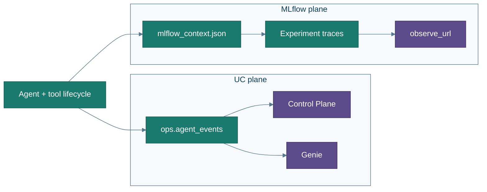
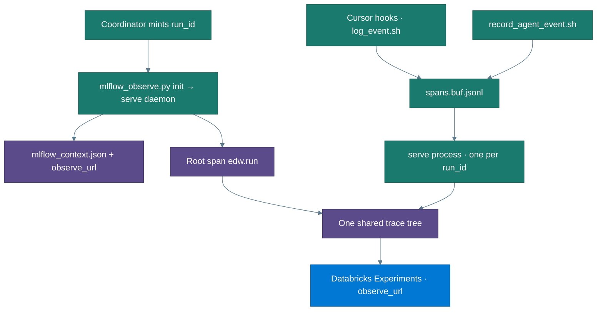

# MLflow observability

MLflow is the **live execution trace** plane for a migration run. It does not replace the Control Plane dashboard or Genie: those answer *what shipped / why Gate failed* from Unity Catalog `ops.*` tables. MLflow answers *what the agents and tools are doing right now* while Convert (and the rest of the pipeline) runs.

← [Architecture](architecture.md) · [What you get](what-you-get.md) · [Using Cursor](cursor-ui.md) · [Troubleshooting](troubleshooting.md)

---

## Role

| Plane | Source of truth | Best for |
|---|---|---|
| **UC events** (`ops.agent_events`) | Hooks + `record_agent_event.sh` | Gate rule 4, Control Plane timeline, Genie Q&A |
| **MLflow traces** | Same lifecycle dual-written via `mlflow_observe.py` | Live parent/child span tree in Databricks Experiments |

MLflow is **additive and soft**: missing `.venv` / `mlflow`, tracking errors, or `EDW_MLFLOW_BACKEND=off` → no-op (exit 0). Migration continues; traces simply do not record.

Traces land in Databricks experiment **`/Shared/edw-migration`** (fallback name `edw-migration` if Shared create fails). Per-run state is `agents/out/<run_id>/mlflow_context.json` (experiment id, trace id, open spans, `observe_url`).



---

## How it is wired



### 1. Run mint (coordinator)

After `run_id` is created, the coordinator runs (prefer repo `.venv`):

```bash
"$(./agents/tools/resolve_python.sh)" agents/tools/mlflow_observe.py init --run-id <run_id>
```

It must paste `observe_url:` / `Observed by MLflow:` to the user **immediately** so they can open live traces while Convert continues. `init` spawns a **single-writer `serve` daemon** that owns the MLflow run and trace. `ensure_run_events.py` re-inits idempotently (same URL if already enabled) and **force-flushes** the Cursor hook buffer into `ops.agent_events`.

Do **not** `--force` re-init because a span failed — that created one orphaned RUNNING run per hook. Empty tree after a pasted `observe_url` means the serve daemon is down; re-run `init` (it will restart serve if the PID is dead).

Bare `python3 agents/tools/mlflow_observe.py …` still re-execs into `.venv` when mlflow is missing, but demos should call `resolve_python.sh` explicitly.

### 2. Cursor hooks (automatic)

With the **repository root** open in **Cursor** (not VS Code alone), [`.cursor/hooks.json`](../.cursor/hooks.json) fires [`.cursor/hooks/log_event.sh`](../.cursor/hooks/log_event.sh) on:

| Hook event | MLflow span | Notes |
|---|---|---|
| `subagentStart` / `subagentStop` | AGENT (`agent.<name>`) | Keyed `subagent:<id>`; status OK/ERROR on stop; stop also flushes UC buffer |
| `afterShellExecution` | TOOL (`tool.shell`) | Plus `shell_success` / `shell_failure` metrics |
| `afterMCPExecution` | TOOL (`tool.mcp`) | MCP tool name in attributes |
| `afterFileEdit` | TOOL (`tool.file_edit`) | Path/detail truncated |

Hooks resolve `run_id` via `CURRENT_RUN` / `_resolve_run_id.sh`, then append span records to `agents/out/<run_id>/spans.buf.jsonl`. The serve daemon (started at mint) is the only process that calls MLflow, so AGENT/TOOL spans nest under one trace. Tool spans prefer an open subagent span as parent when present.

**Flush:** default `AGENT_EVENT_FLUSH_THRESHOLD=1`. The 15s Cursor hook **does not wait** on warehouse INSERT — it `flock`s `flush.lock` and runs `_flush_events.sh` in the background. Milestone helpers (`record_agent_event.sh`, `ensure_run_events.py`, `on_subagent_stop.sh`) still force-flush synchronously. Checkpoint helper: `./agents/tools/observe_status.sh --stage <Name>`.

**MLflow lifecycle:** `stage(gate, completed)` logs `gate_pass` and does **not** end the run (retries stay live). Coordinator calls `mlflow_observe.py end-run` at **Done**.

**Stale sink:** dashboard widgets that filter by `run_id` prefer the latest `ops.agent_events` row, then `migration_manifest_current`. Prior-run backlog/load_control still need `make reset-sink` (tables/rows) or `make teardown-databricks` (full Databricks wipe; keeps Azure).

### 3. Milestone dual-write

`record_agent_event.sh` inserts into `ops.agent_events` **and** calls `mlflow_observe.py stage` for stage/chain spans (Discover → Assess → Convert → Test → Gate milestones).

### 4. Subagents

Every Cursor subagent is observed the same way — hooks map the payload to an agent name and open/close AGENT spans:

| Subagent | Typical role on the tree |
|---|---|
| `edw-start` | Front door / menu (short-lived) |
| `edw-demo-guide` | Track A orchestration |
| `edw-coordinator` | Discover → land → fan-out → Test → Gate |
| `edw-assess` | Readonly backlog (when routines in scope) |
| `edw-convert` | Parallel Convert workers (fan-out waves) |
| `edw-test` | Reconcile report |
| `edw-gate` | Ship / no-ship manifest |

Convert fan-out appears as **parallel child AGENT spans** under the run root. Shared memory between agents remains disk artifacts under `agents/out/<run_id>/`; MLflow only observes lifecycle, it does not pass chat context.

### 5. Announce URLs

`make print-urls` / `print_observability_urls.sh` prints Control Plane + Genie + Catalog + Job + Notebooks (`edwmigration_YYYYMMDD`) + MLflow `observe_url` when each exists. Setup-time print-urls often lack `observe_url` until mint, and lack **Notebooks** until Land (`publish_run_notebooks.py`). Catalog is printable after setup. Job appears after `make deploy`.

---

## Setup and health

| Step | Command |
|---|---|
| One-time deps | `make observe-setup` (repo `.venv` + `mlflow>=3.8`) |
| Health | `./agents/tools/check_mlflow_observe.sh` (also from soft status / Track A preflight) |
| Auth | Same Databricks session as the CLI (`DATABRICKS_HOST` + profile/PAT) |

Soft status / preflight **WARN** if observe is not ready; they do **not** block the menu or migration. See [prerequisites.md](prerequisites.md) and [troubleshooting.md](troubleshooting.md).

---

## While you watch

1. Open the **repo root** in Cursor so hooks load ([cursor-ui.md](cursor-ui.md)).  
2. Run `make observe-setup` once per machine.  
3. Type **`start`** → choose menu **1 / 2 / 3** (agents must not invent a migration on bare `start`).  
4. If offered `make reset-sink` before mint (stale dashboard from a prior demo): answer yes/no once — never expect auto-reset.  
5. When setup/mint prints Control Plane + Genie + Catalog + `observe_url`, **open them once** and leave them open. After Land, open **Notebooks**; after deploy, open **Job**.  
6. After each stage, chat should show `observe_status` counts (not another URL essay).  
7. Mid-run: Events for this `run_id`, MLflow AGENT spans, Genie on inventory/events. Gate Hero stays empty until Gate — expected.

## Maintainer anti-patterns

- Bare-`start` migration (only menu **1/2/3** may migrate).  
- Opaque Task / `generalPurpose` for Assess/Convert/Test/Gate without `dual_write_agent_lifecycle.sh` (Convert: **`--item-id` per item**).  
- Waiting until Gate to open URLs.

---

## Key files

| Path | Role |
|---|---|
| `agents/prompts/_live_observability.md` | Shared live-during contract |
| `agents/tools/mlflow_observe.py` | init / serve / span queue / stage / metric / end-run / trace-url / experiment-purge |
| `agents/tools/mlflow_context.py` | Locked read/write of `mlflow_context.json` |
| `.cursor/hooks.json` + `.cursor/hooks/log_event.sh` | Cursor lifecycle → UC buffer + span queue |
| `agents/tools/record_agent_event.sh` | UC row + MLflow stage enqueue + force flush |
| `agents/tools/dual_write_agent_lifecycle.sh` | Fallback UC + MLflow start/stop when hooks cannot fire (Convert: `--item-id` per worker) |
| `agents/tools/ensure_run_events.py` | Milestone rows + idempotent MLflow init (starts serve) |
| `agents/tools/check_mlflow_observe.sh` | venv + `mlflow≥3.8` + host readiness |
| `agents/tools/observe_status.sh` | Ops counts + URLs snapshot for stage checkpoints |
| `agents/tools/print_observability_urls.sh` | Control Plane + Genie + Catalog + Job + Notebooks + observe_url |
| `agents/tools/publish_run_notebooks.py` | SQL → Workspace `edwmigration_YYYYMMDD` notebooks |
| `agents/tools/reset_databricks_sink.sh` | Wipe managed sink + views + `agents/out` (keeps Azure) |
| `agents/tools/teardown_databricks.sh` | Destroy Databricks demo assets (keeps Azure SQL) |

---

## Related

- [Architecture — Observability](architecture.md#observability) · [What you get](what-you-get.md#control-plane--genie--mlflow) · [Agents README](../agents/README.md) · [Glossary](glossary.md)
