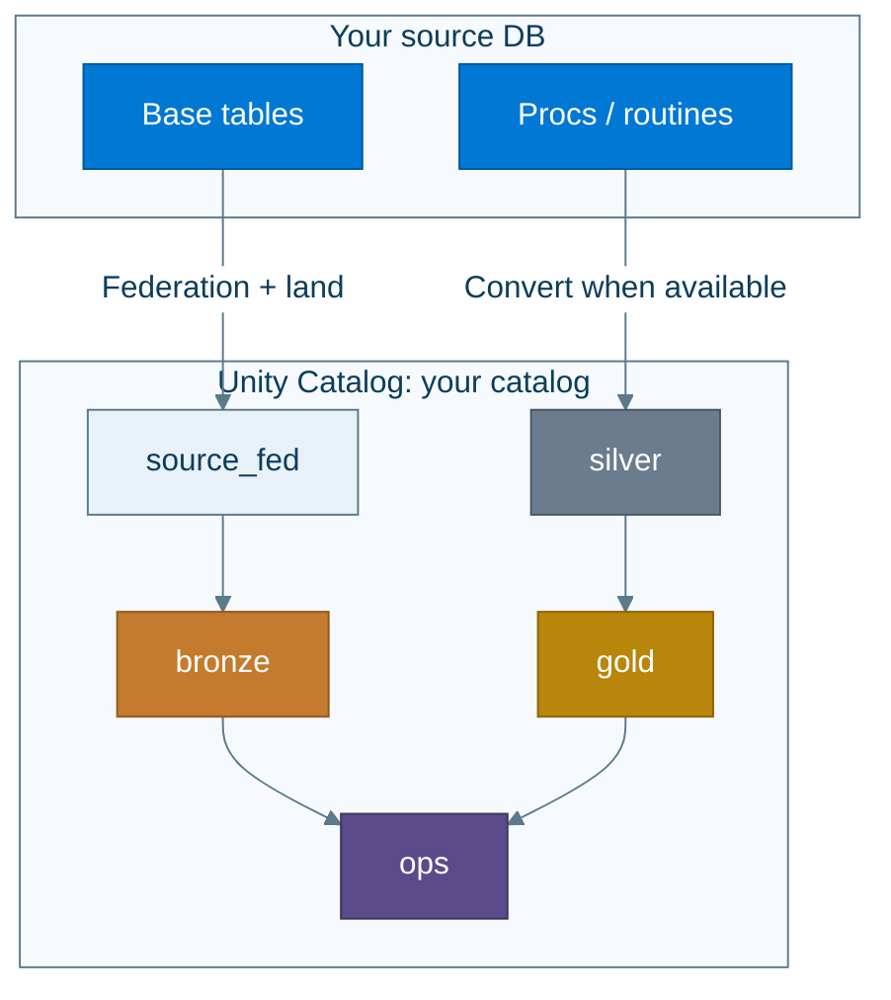
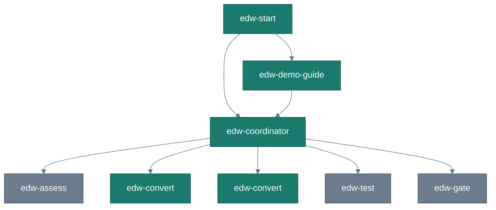
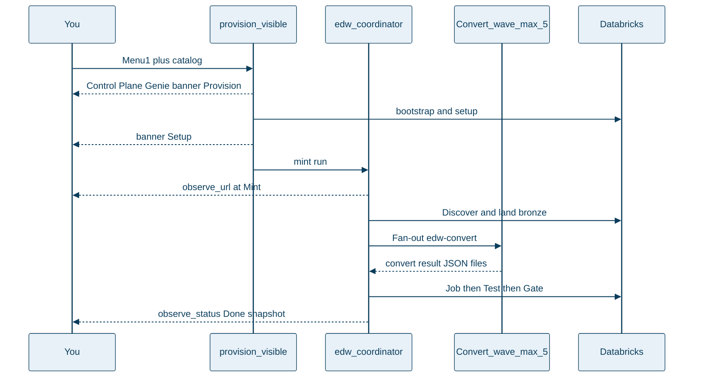

# What you get

Plain-English picture of the outcome — before you run anything.

← [Getting started](getting-started.md) · [Glossary](glossary.md) · Next: [Guided demo](guided-demo.md)

---

## One catalog, five schemas

You choose a name (`DATABRICKS_CATALOG`, for example `edw_migration`). Inside it:

| Schema | Role |
|---|---|
| `source_fed` | Stable views over the live federated source |
| `bronze` | 1:1 landed base tables (+ audit columns) |
| `silver` / `gold` | Converted procedure logic (when routines/procs were converted) |
| `ops` | Inventory, backlog, reconcile, Gate summary, agent events |

**Landed objects are base tables only** (not views). Discovery finds everything visible after connect — you do not paste a table list.

---

## The migration sequence

| Stage | What it means |
|---|---|
| **Discover** | List base tables (+ export procs/routines if tools allow) |
| **Land** | Copy each table into `bronze.*` and record counts |
| **Convert** | Turn T-SQL / MySQL routines into Spark SQL notebooks in **parallel waves (≤5)** via `edw-convert` *(skipped cleanly if none)* |
| **Test** | Bronze row counts vs source |
| **Gate** | Ship / no-ship from inventory + reconcile + conversions |
| **Observe** | Control Plane dashboard + Genie Q&A + MLflow live traces (`observe_url`) |

Also: [`img/agent_squad_roles.png`](img/agent_squad_roles.png) (README comparison poster: agents + MLflow observe planes) · [`img/agent_delegation.mmd`](img/agent_delegation.mmd) · [`img/architecture.mmd`](img/architecture.mmd)

---

## What you will see while it works

You are not expected to stare at terminals the whole time. Typical pauses:

1. **Inventory** — table (and proc) counts after Discover  
2. **Convert wave** — up to five `edw-convert` agents writing notebooks in parallel  
3. **Merge** — `convert_summary.json` with converted / blocked counts  
4. **Job → Test → Gate** — medallion run, bronze reconcile, ship / no-ship  
5. **URLs** — Control Plane + Genie appear at **Provision** (best-effort if a prior deploy exists) and again at **Setup** via `announce_observability` / `make print-urls`. MLflow `observe_url` joins at **Mint**. Open them when printed and leave them open — not only at Gate.

---

## Run artifacts map

Everything for one run lives under `agents/out/<run_id>/` (also pointed at by `agents/out/CURRENT_RUN`):

| Artifact | Meaning |
|---|---|
| `context.json` | Catalogs, host, retries, `SOURCE_TYPE` |
| `inventory.json` | Discovered tables + procs/routines |
| `migration_backlog.json` | Assess output (empty OK if routines skipped) |
| `assess_summary.md` | Optional Assess narrative (if persisted) |
| `convert/<item_id>.json` | One Convert worker result (fan-out handoff) |
| `convert_summary.json` | Merged converted / blocked counts |
| `merge_failed.json` | Present only if ops merge failed (fix before continuing) |
| `reconcile_report.json` | Test pass/fail checks |
| `migration_manifest.json` | Gate ship / no-ship + blockers |
| `mlflow_context.json` | MLflow experiment/trace ids + `observe_url` (after observe init) |

---

## Control Plane + Genie + MLflow

After setup: `make print-urls` (Dashboard + Genie). After the coordinator mints a run: same command also prints **`observe_url`** when MLflow observe is ready (`make observe-setup`).

- **Control Plane** — Gate, timeline, backlog, reconcile. Gate Hero stays empty until Gate; Inventory / Events / Backlog move earlier.  
- **Genie** — *Did the last run ship?* / *Why did the gate fail?* (also useful mid-run on inventory/events)  
- **MLflow** — live subagent/tool span tree while Convert runs (Cursor hooks dual-write every `edw-*` agent + shell/MCP/file tools). Soft no-op until `make observe-setup`.  
- **Cursor chat** — `observe_status` after each stage (URLs pasted once at setup/mint).

Deep dive: **[MLflow observability](mlflow.md)** (role, wiring, all subagents).

Trust checklist: inventory → convert artifacts (when procs in scope) → bronze reconcile pass → Gate blockers empty.

---

## Track A vs Track B (same destination)

| | Track A — Guided demo | Track B — Your DB |
|---|---|---|
| Source | Sample WideWorldImporters on free Azure SQL | Your Azure SQL or Azure MySQL |
| Entry | `start` → **1** (or `edw-demo-guide`) | `start` → **2** / **3** (or `edw-coordinator`) |
| Agent | `edw-demo-guide` → coordinator | `edw-coordinator` |
| Cost (typical) | $0 with Free Edition + teardown | Your existing DB + Free Edition sink |
| Outcome | Same catalog shape + dashboard + Genie + MLflow traces | Same |

Production-shaped controls: **[Enterprise](enterprise.md)**.

---

## Next

→ **[Guided demo](guided-demo.md)** · **[Your database](your-database.md)** · **[Enterprise](enterprise.md)** · **[Architecture](architecture.md)** · **[MLflow](mlflow.md)**
