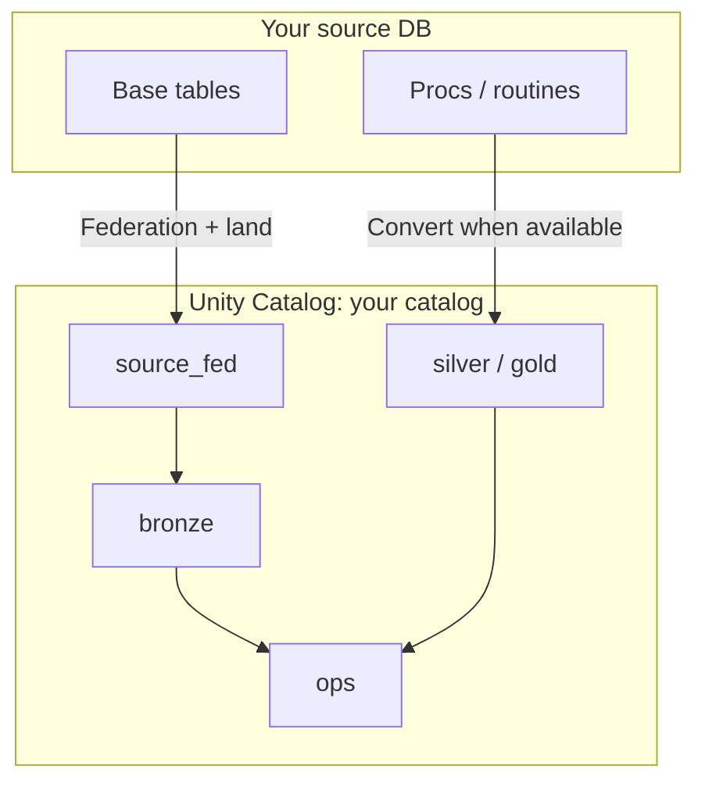
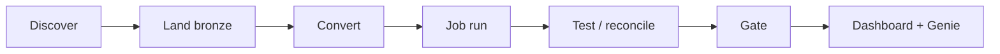
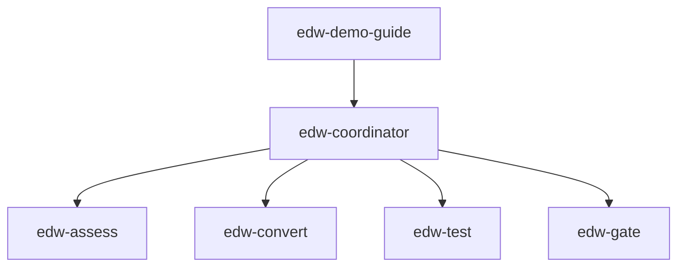

# What you get

Plain-English picture of the outcome — before you run anything.

← [Getting started](getting-started.md) · Next: [Guided demo](guided-demo.md)

---

## One catalog, five schemas

You choose a name (`DATABRICKS_CATALOG`, for example `edw_migration`). Inside it:

| Schema | Role |
|---|---|
| `source_fed` | Stable views over the live federated source |
| `bronze` | 1:1 landed base tables (+ audit columns) |
| `silver` / `gold` | Converted procedure logic (when routines/procs were converted) |
| `ops` | Inventory, backlog, reconcile, Gate summary, agent events |

**Landed objects are base tables only** (not views). Discovery finds everything visible after connect — you do not paste a table list.

---

## The migration sequence

| Stage | What it means |
|---|---|
| **Discover** | List base tables (+ export procs/routines if tools allow) |
| **Land** | Copy each table into `bronze.*` and record counts |
| **Convert** | Turn T-SQL / MySQL routines into Spark SQL notebooks *(skipped cleanly if none)* |
| **Test** | Bronze row counts vs source |
| **Gate** | Ship / no-ship from inventory + reconcile + conversions |
| **Observe** | Control Plane dashboard + Genie Q&A |

Agents: `edw-demo-guide` (walkthrough) or `edw-coordinator` (full run), with helpers `edw-assess`, `edw-convert`, `edw-test`, `edw-gate`.

---

## Control Plane + Genie

After setup, run (or let the agent run) `make print-urls`:

- **Control Plane** — Gate, timeline, backlog, reconcile (AI/BI dashboard)  
- **Genie** — ask things like *Did the last run ship?* / *Why did the gate fail?*  

These are how you *see* the black box. Trust checklist:

1. Inventory exists for the run  
2. Bronze reconcile passes  
3. Gate blockers empty  

---

## Track A vs Track B (same destination)

| | Track A — Guided demo | Track B — Your DB |
|---|---|---|
| Source | Sample WideWorldImporters on free Azure SQL | Your Azure SQL or Azure MySQL |
| Agent | `edw-demo-guide` | `edw-coordinator` |
| Cost (typical) | $0 with Free Edition + teardown | Your existing DB + Free Edition sink |
| Outcome | Same catalog shape + dashboard + Genie | Same |

---

## Next

→ **[Guided demo](guided-demo.md)** — try it  
→ **[Your database](your-database.md)** — when you’re ready for real data  
→ **[Architecture](architecture.md)** — engine detail
