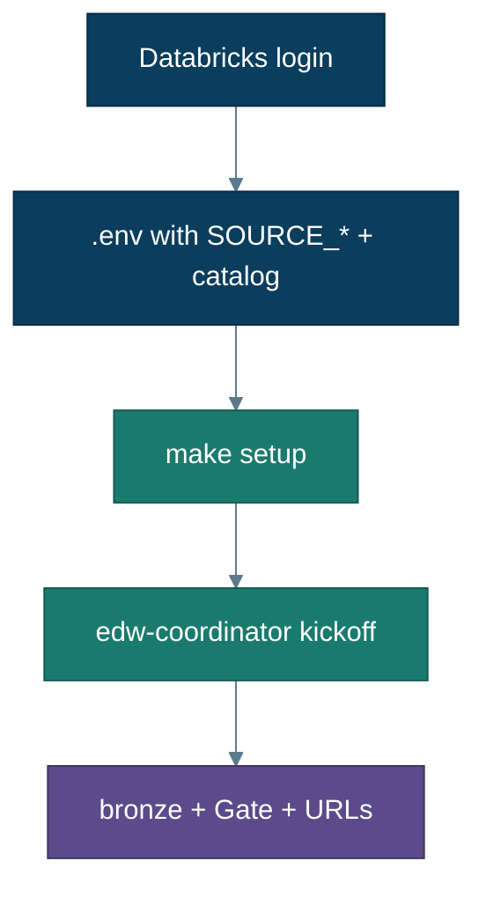
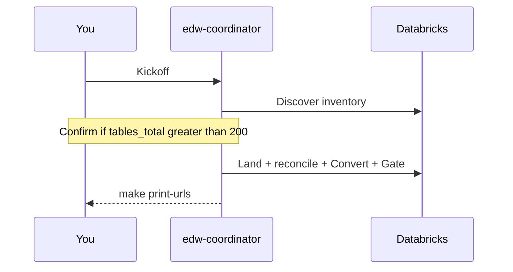

# Your database (Track B)

Use this after you’ve done the [guided demo](guided-demo.md), or when you already know you want to point at **your** Azure SQL or Azure MySQL.

Same destination as Track A: a user-named Unity Catalog catalog, bronze land, Gate, Control Plane, Genie. You bring connection fields; **`edw-coordinator`** does the rest.

← [Getting started](getting-started.md) · [Guided demo](guided-demo.md) · [Enterprise](enterprise.md) · [Troubleshooting](troubleshooting.md)



---

## Shared requirements

- [Getting started](getting-started.md) complete (repo root, agents, Databricks CLI)  
- Serverless SQL warehouse  
- `CREATE CONNECTION` + `CREATE CATALOG` (or admin)  
- Source reachable from Free Edition (firewall / public access for demos — [firewall.md](firewall.md))

**SqlPackage is not required** for `make setup` on Track B.

---

## Option 1 — Azure MySQL

1. Copy env template and edit:

```bash
cp infra/azure/.env.example .env
```

Set at least:

```bash
SOURCE_TYPE=mysql
SOURCE_HOST=myserver.mysql.database.azure.com
SOURCE_PORT=3306
SOURCE_DATABASE=mydb
SOURCE_USER=myuser@myserver
SOURCE_PASSWORD=...
DATABRICKS_HOST=https://dbc-XXXX.cloud.databricks.com
DATABRICKS_WAREHOUSE_ID=...
DATABRICKS_CATALOG=my_edw
# Optional: leave FOREIGN_CATALOG / CONNECTION_NAME unset (defaults to mysql_fed)
```

2. Allow the warehouse to reach MySQL (demo-style public rule — lock down for real data):

```bash
az mysql flexible-server firewall-rule create \
  --resource-group <rg> --name <server> \
  --rule-name AllowDatabricksDemo \
  --start-ip-address 0.0.0.0 --end-ip-address 255.255.255.255
```

3. Wire the sink:

```bash
make setup
```

4. In Cursor, launch **`edw-coordinator`** and say:

   > Migrate my Azure MySQL into catalog `my_edw`. Host/user/db are in `.env` (or I’ll paste them).

**Tables** always migrate. **Routines** export if the `mysql` CLI is installed; otherwise the run notes the skip and Gate still ships on land + reconcile.

SSL is required for MySQL Federation; this repo defaults `SOURCE_TRUST_SERVER_CERTIFICATE=true` for demos.

---

## Option 2 — Existing Azure SQL

```bash
cp infra/azure/.env.example .env
```

```bash
SOURCE_TYPE=sqlserver
SOURCE_HOST=myserver.database.windows.net
SOURCE_PORT=1433
SOURCE_DATABASE=MyDb
SOURCE_USER=...
SOURCE_PASSWORD=...
DATABRICKS_HOST=...
DATABRICKS_WAREHOUSE_ID=...
DATABRICKS_CATALOG=my_edw
```

(You may use `AZ_SQL_*` names instead; they map into `SOURCE_*`.)

```bash
make setup
```

Launch **`edw-coordinator`**:

> Start an EDW migration run against my Azure SQL.

Do **not** open `0.0.0.0/0` on a production database — see [firewall.md](firewall.md).

---

## During the run



- No object list required.  
- If inventory exceeds **200 tables**, confirm before land.  
- Afterward: `make print-urls` → Control Plane + Genie.  

Trust checklist: inventory → bronze reconcile pass → Gate blockers empty.

---

## Next

- Errors → [Troubleshooting](troubleshooting.md)  
- Short commands → [Runbook](runbook.md)  
- Production controls → [Enterprise](enterprise.md)  
- How discovery/land work → [Architecture](architecture.md)
